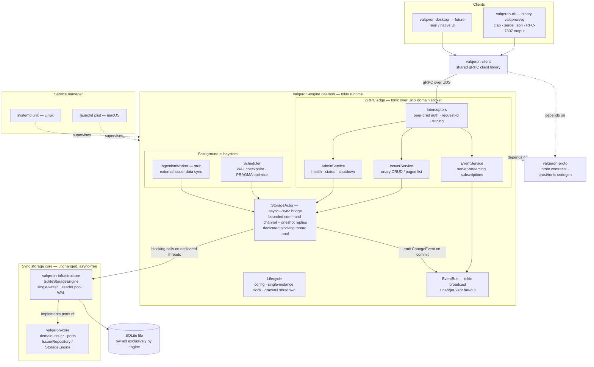

# Valqeron Engine — Background Daemon Architecture

Status: **Proposed** (no code written yet)
Scope: introduce `valqeron-engine`, a long-running background service (launchd on macOS, systemd on Linux) that owns the
Valqeron datastore and serves the CLI, its own internal background workers, and a future desktop application —
concurrently.

---

## 1. Context

Valqeron today is a **one-shot CLI**. `valqeron-cli` opens SQLite directly, runs a single command, prints a JSON
envelope, and exits. The workspace is a clean ports-and-adapters layering:

| Crate                     | Role                                                                                                |
|---------------------------|-----------------------------------------------------------------------------------------------------|
| `valqeron-core`           | Domain (`Issuer`) + ports (`IssuerRepository`, `StorageEngine`). No I/O.                            |
| `valqeron-infrastructure` | SQLite adapter (`SqliteStorageEngine`): single-writer connection + read-only pool, WAL, migrations. |
| `valqeron-cli`            | Composition root / driving adapter. Binary `valqeron` (alias `vq`).                                 |

Two properties of the current design dominate the daemon design:

1. **SQLite is single-writer.** `valqeron-infrastructure` implements this with one writer connection behind a `Mutex`
   plus a `Condvar`-based read-only connection pool. That concurrency model is verified with `loom` tests.
2. **The entire codebase is synchronous.** There is no `tokio`, no `async` anywhere. It uses
   `std::thread`, `Mutex`, and `Condvar` deliberately.

Once the CLI, engine-internal background jobs, and a desktop app all need data access at the same time, "every process
opens the DB file" stops being viable: migrations race, background jobs have no home, and there is no way to push change
notifications to a UI.

## 2. Decisions

These were decided up front and drive everything below.

| #  | Decision                                                                                                                             | Rationale                                                                                                                             |
|----|--------------------------------------------------------------------------------------------------------------------------------------|---------------------------------------------------------------------------------------------------------------------------------------|
| D1 | **The engine daemon owns the SQLite database exclusively.** CLI and desktop become thin clients.                                     | Preserves the single-writer invariant across processes; gives migrations and background jobs one unambiguous owner.                   |
| D2 | **Transport is gRPC (tonic).**                                                                                                       | Strongly typed, has first-class server streaming (needed for change notifications), and is cross-language for the future desktop app. |
| D3 | **Introduce `tokio`** — but only at the engine's I/O edge.                                                                           | Required by tonic. Contained so `core` and `infrastructure` remain async-free.                                                        |
| D4 | **Background work in scope:** domain data sync/ingestion, change notifications/event streaming, and a generic maintenance scheduler. | Ingestion starts as a stub pending source selection.                                                                                  |

### 2.1 The central design problem: async edge over a sync core

`IssuerRepository` and `StorageEngine` are **blocking** traits. tonic handlers are `async`. Calling the blocking
connection pool directly from a tokio worker thread would stall the runtime and can deadlock the `Condvar` checkout in
the reader pool.

**Resolution — the `StorageActor` bridge.** The synchronous
`PersistenceManager<SqliteStorageEngine>` is owned by a dedicated pool of OS threads. gRPC handlers translate a request
into a storage command, send it over a bounded channel, and
`await` a `oneshot` reply.

Consequences:

- The loom-verified single-writer pool is used exactly as designed, untouched.
- `valqeron-core` and `valqeron-infrastructure` gain **zero** async dependencies.
- Backpressure is explicit and bounded at the channel, not implicit in thread starvation.

This bridge is the highest-risk component and is scheduled early (Milestone 3) so a thin end-to-end slice can validate
it before events and background work are layered on.

---

## 3. Architecture

### 3.1 Crates

| Crate                     | Status    | Purpose                                                                             | Key deps                                                                       |
|---------------------------|-----------|-------------------------------------------------------------------------------------|--------------------------------------------------------------------------------|
| `valqeron-proto`          | new       | `.proto` contracts + generated types. One source of truth for CLI, engine, desktop. | `tonic`, `prost`, `tonic-build`                                                |
| `valqeron-engine`         | new       | The daemon binary: async edge, storage bridge, background subsystem, lifecycle.     | `tokio`, `tonic`, `valqeron-core`, `valqeron-infrastructure`, `valqeron-proto` |
| `valqeron-client`         | new       | Thin reusable gRPC client (CLI now, desktop later). Hides transport, retry, auth.   | `tonic`, `valqeron-proto`                                                      |
| `valqeron-cli`            | modified  | Gains an engine-client dispatch path; keeps existing DTOs and RFC-7807 output.      | `+ valqeron-client`                                                            |
| `valqeron-core`           | unchanged | Domain + ports. Stays async-free.                                                   | —                                                                              |
| `valqeron-infrastructure` | unchanged | SQLite adapter. Stays async-free.                                                   | —                                                                              |

### 3.2 Key mechanisms

1. **StorageActor bridge** — keeps the loom-tested sync pool intact while serving async gRPC. Reads fan out across the
   reader pool; writes serialize on the writer mutex exactly as today.
2. **EventBus** (`tokio::sync::broadcast`) — every successful mutation, whether from a client or the ingestion worker,
   publishes a `ChangeEvent`. `EventService` streams these to subscribers for live UI updates.
3. **Single-instance guard** — an advisory `flock` next to the DB file plus stale-socket cleanup. Guarantees only one
   process ever opens the database, preserving single-writer correctness across process boundaries.
4. **Service management** — launchd `.plist` (macOS) and systemd unit (Linux), both able to use socket activation for
   on-demand start.
5. **Migrations** run once at engine startup, before the server accepts connections. No more cross-process migration
   races.
6. **CLI dispatch switch** — engine mode by default when the socket is live; a guarded direct-DB mode remains for
   offline/admin use. The existing JSON envelope and exit codes are preserved either way.

### 3.3 Cross-cutting concerns

- **Security / auth** — Unix socket file permissions (0700 parent dir) plus a peer-credential check for local clients.
  Token or mTLS only if a TCP-loopback listener is ever exposed.
- **Observability** — reuse the existing `tracing` stack; add per-request spans and request-ids via tonic interceptors;
  keep the dedicated `valqeron::audit` target.
- **Backpressure / limits** — bound the actor command channel; size the blocking pool to mirror
  `reader_pool_size`; enforce a per-request deadline consistent with the existing 15s SQLite progress-handler timeout.
- **Lints** — all new code must satisfy the workspace's denied lints (`unwrap_used`,
  `expect_used`, `panic`, `indexing_slicing`, `arithmetic_side_effects`, `as_conversions`,
  `todo`). Generated protobuf code is the documented exception (see R1).

---

## 4. Plan review — refinements and risks

Findings from reviewing the design against the actual codebase constraints.

| #  | Risk / refinement                                                                                                           | Resolution                                                                                                                                                                                                                                     |
|----|-----------------------------------------------------------------------------------------------------------------------------|------------------------------------------------------------------------------------------------------------------------------------------------------------------------------------------------------------------------------------------------|
| R1 | **Generated code violates workspace lints.** `prost`/`tonic` codegen emits `as` casts and other denied patterns.            | Wrap generated modules in scoped `#[allow(...)]` inside `valqeron-proto`. Tracked as an explicit task, not an afterthought.                                                                                                                    |
| R2 | **`--dry-run` does not survive IPC as-is.** Today it wraps a closure around a writer `SAVEPOINT`.                           | Becomes a per-request flag executed **inside a single StorageActor command** — one RPC equals one `dry_run` closure. Multi-RPC dry-run sessions are explicitly out of scope.                                                                   |
| R3 | **Event emission point.** rusqlite's `hooks` feature is already enabled, but `update_hook` is untyped (table + rowid only). | Emit typed `ChangeEvent`s at the StorageActor commit point instead of at the SQLite layer.                                                                                                                                                     |
| R4 | **Socket-bind alone is a weak single-instance guard** (stale sockets after a crash).                                        | Advisory `flock` next to the DB as the authority, plus stale-socket cleanup on boot.                                                                                                                                                           |
| R5 | **Direct-DB CLI fallback contradicts D1.**                                                                                  | Direct mode must check the engine's flock and refuse to open the DB while the daemon is running.                                                                                                                                               |
| R6 | **Async containment must be enforced, not assumed.**                                                                        | `tokio`/`tonic` enter only `proto`, `engine`, and `client`. Add a CI check asserting `core` and `infrastructure` have no async deps. De-risk the bridge by driving a thin end-to-end slice (Milestones 3–5) before events and background work. |

---

## 5. Implementation phases

> **The live backlog is [`docs/backlog/`](../backlog/README.md)** — one file per work item with
> tasks, acceptance criteria, test strategy, and dependency metadata. This section is the
> summary; the backlog is what developers work from.

Issue numbers are plan-local identifiers, not GitHub issue numbers.

### Milestone 0 — Decisions & scaffolding

- **#1 — ADR: engine architecture decisions.**
  Record: engine owns the DB; gRPC/tonic over UDS; tokio at the edge only; desktop transport (UDS vs TCP-loopback+TLS);
  ingestion sources; Windows deferred. *Acceptance:* ADR merged under `docs/adr/`.

- **#2 — Workspace scaffolding.** *(depends: #1)*
  Add `valqeron-proto`, `valqeron-engine`, `valqeron-client` crates. Wire workspace deps (`tokio`, `tonic`, `prost`,
  `tonic-build`). Extend Justfile/CI. Establish the generated-code lint strategy (R1).

### Milestone 1 — Contract (`valqeron-proto`)

- **#3 — Proto v1 definitions.** *(depends: #2)*
  Messages: `Issuer`, `IssuerPatch`, version field, `WriteOutcome`, `ChangeEvent`, error detail. Services:
  `IssuerService` (unary), `EventService` (server-streaming), `AdminService`.

- **#4 — Codegen + mapping layer.** *(depends: #3)*
  `tonic-build` pipeline, scoped lint allows, and domain ⇄ proto round-trip tests.

### Milestone 2 — Engine daemon skeleton

- **#5 — Daemon binary bootstrap.** *(depends: #2; parallel with Milestone 1)*
  tokio runtime, config resolution (`directories`, env, flags — mirroring the CLI), dual-layer
  `tracing` init.

- **#6 — Lifecycle & single instance.** *(depends: #5)*
  Advisory flock (R4), UDS bind with 0700 parent dir, stale-socket cleanup, SIGTERM/SIGINT graceful shutdown: stop
  accepting → drain in-flight → stop workers → drop engine (WAL checkpoint runs on `Drop`).

### Milestone 3 — StorageActor (async→sync bridge) — highest risk

- **#7 — StorageActor core.** *(depends: #5)*
  Command enum, bounded mpsc plus `oneshot` replies, dedicated blocking threads sized to
  `reader_pool_size + 1`. Owns `PersistenceManager<SqliteStorageEngine>`.

- **#8 — Dry-run + error taxonomy.** *(depends: #7)*
  Per-command dry-run flag via the engine savepoint (R2). Map `StorageFault` and `WriteOutcome`
  into typed engine errors.

- **#9 — Bridge concurrency tests.** *(depends: #7)*
  Prove no tokio worker ever blocks; mixed read/write load; queue-full backpressure behaviour.

### Milestone 4 — IssuerService end-to-end slice

- **#10 — Unary RPCs.** *(depends: #4, #7)*
  register / get / list (paged) / patch / delete, all routed through the actor.

- **#11 — gRPC error mapping.** *(depends: #10)*
  Engine errors → `Status` codes (`NotFound`, `FailedPrecondition` for version mismatch,
  `ResourceExhausted`, …) with a detail payload preserving RFC-7807 semantics.

- **#12 — Interceptors.** *(depends: #10)*
  Request-id, per-request tracing spans, UDS peer-credential auth.

### Milestone 5 — CLI client mode

- **#13 — `valqeron-client` library.** *(depends: #4)*
  Socket discovery, connect/retry/timeout, version handshake.

- **#14 — CLI dispatch switch.** *(depends: #11, #13)*
  Engine mode (default when the socket is live) vs direct-DB mode (guarded by the flock check per R5, opt-in via
  `--direct`). Preserve the JSON envelope and exit codes.

- **#15 — `valqeron engine` subcommands.** *(depends: #13)*
  `status`, `ping`.

### Milestone 6 — Service management

- **#16 — launchd plist (macOS).** *(depends: #6)*
  `RunAtLoad` / `KeepAlive`, log paths, install/uninstall docs or an `engine install` command.

- **#17 — systemd unit (Linux).** *(depends: #6)*
  Hardening directives, restart policy.

- **#18 — Socket activation (stretch).** *(depends: #16, #17)*
  launchd `Sockets` / systemd `.socket`; build the listener from the inherited fd.

### Milestone 7 — Events

- **#19 — EventBus.** *(depends: #7)*
  `tokio::sync::broadcast`; emit `ChangeEvent` at actor commit points (R3), covering both client and background
  mutations.

- **#20 — EventService streaming.** *(depends: #12, #19)*
  Subscribe RPC with filters; lag/overflow policy (broadcast `Lagged` → resync marker).

- **#21 — CLI `watch` command.** *(depends: #14, #20)*
  First streaming consumer; validates the desktop-app story end to end.

### Milestone 8 — Background subsystem

- **#22 — Scheduler.** *(depends: #7)*
  Periodic maintenance (WAL checkpoint, `PRAGMA optimize`) with jitter; shutdown-aware.

- **#23 — IngestionWorker stub.** *(depends: #19, #22)*
  Worker trait plus config gating. Mutations go through the actor; events through the bus. Real sources pending ADR #1.

### Milestone 9 — Admin, hardening, docs

- **#24 — AdminService.** *(depends: #12)*
  Health/readiness, status (uptime, DB path, pool and queue stats), authz-gated shutdown RPC.

- **#25 — Backpressure & limits.** *(depends: #9, #20)*
  Channel bounds, per-request deadline mirroring the 15s progress handler, max connections.

- **#26 — Architecture doc + ops runbook.** *(depends: all)*
  Final diagram, failure modes, install and upgrade procedures.

### 5.1 Sequencing

**Critical path:** #2 → #5 → #7 → #10 → #14 — the first end-to-end CLI → engine → SQLite slice.

- Milestone 1 (contract) runs in parallel with Milestone 2 (daemon skeleton).
- Milestone 6 (service management) runs in parallel with Milestones 4–5.
- Milestones 7 and 8 begin only after the end-to-end slice proves the bridge.

---

## 6. Open questions

These feed into ADR #1 and are unresolved at time of writing.

1. **Desktop transport.** A Unix socket is cleanest for the CLI. If the desktop app is web-based or Tauri, does it also
   need a TCP-loopback + TLS listener, or will it use the same Unix socket? This determines the auth design.
2. **Ingestion sources.** Which external data source (s) feed issuer sync? This scopes the outbound HTTP client and
   scheduling in #23.
3. **`valqeron-client` extraction timing.** Ship the shared client crate in the first slice, or inline the client into
   the CLI and extract it once the desktop app materialises?
4. **Windows support.** In scope now (named pipes), or deferred? Current plan targets launchd and systemd only.
