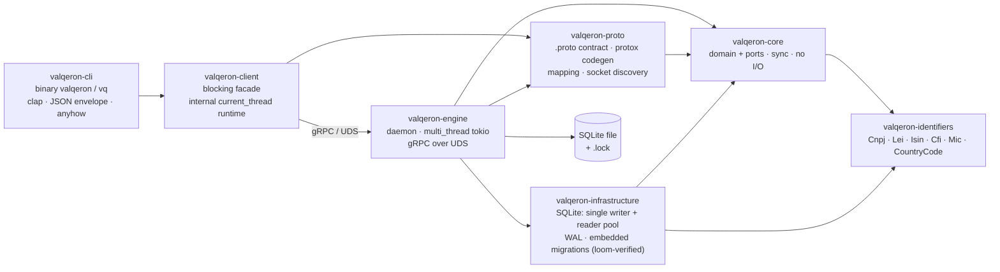
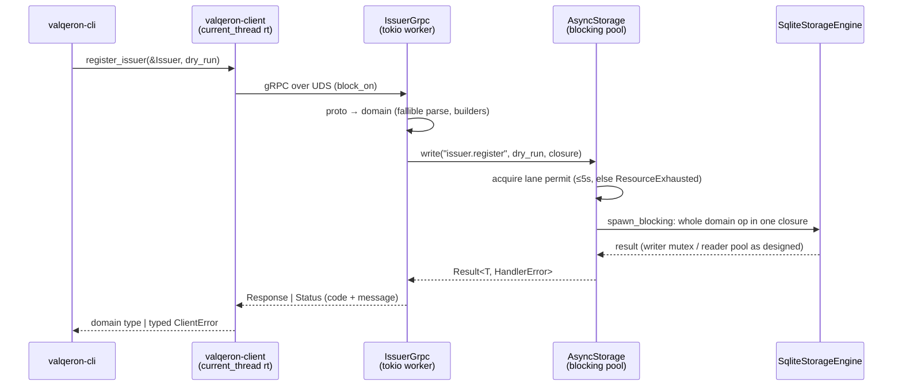

# Valqeron Engine — Architecture

Status: **implemented**. This describes the system as built, not a plan.

`valqeron-engine` is a user-bounded daemon that **owns the SQLite database exclusively** and serves it to clients over
gRPC on a Unix domain socket. The CLI (`valqeron`/`vq`) is a pure client: it contains no database code and cannot
function without a running engine.

## Crate graph



| Crate                     | Role                                                                                                                                                                                                        | Async?                               |
|---------------------------|-------------------------------------------------------------------------------------------------------------------------------------------------------------------------------------------------------------|--------------------------------------|
| `valqeron-core`           | Aggregates (`Issuer`, `Security`, `Listing`, `Venue`) + blocking ports (`*Repository`, `StorageEngine`).                                                                                                    | no — enforced by `just deps-check`   |
| `valqeron-identifiers`    | Fully validated identifier types; invalid state unrepresentable.                                                                                                                                            | no                                   |
| `valqeron-infrastructure` | SQLite adapter: one writer behind a `Mutex`, `Condvar` reader pool, WAL, compile-time-embedded migrations. **Private to the engine** — no other crate may depend on it.                                     | no — enforced                        |
| `valqeron-proto`          | Single wire-contract source of truth: `.proto` files, generated tonic types (lint-quarantined), fallible domain⇄proto mapping, socket discovery, `PROTOCOL_VERSION`. | types only, no runtime               |
| `valqeron-client`         | Blocking client: connect + handshake, typed errors, returns domain types. No clap, no stdout.                                                                                                               | hides a `current_thread` runtime     |
| `valqeron-cli`            | Thin client binary. Local pre-validation for UX; the engine is authoritative.                                                                                                                               | no async code; tokio only transitive |
| `valqeron-engine`         | This daemon.                                                                                                                                                                                                | `multi_thread` tokio at the edge     |

Dependency rules: `infrastructure` is reachable only from `engine`; `tokio`/`tonic` appear only in `proto` (types),
`client`, and `engine`. `core` and `infrastructure` stay sync — that is the invariant the whole design protects.

## Engine internals

```
main.rs ── no argv (any argument is a config error) + logging init: stderr
│          (info default, RUST_LOG overrides) + JSON file; valqeron::audit
│          stays on stderr
├── engine.rs     the whole lifecycle, consolidated: EngineConfig resolution
│                 (VALQERON_* env > platform dir), EngineLock (exclusive
│                 advisory flock on <db>.lock), typed boot phases (lock →
│                 socket prep → open → bind → runtime), run_loop (serve →
│                 signal → ordered drain), checkpoint-safe teardown, exit codes
├── storage.rs    AsyncStorage: the async→sync bridge (read/write lanes)
├── lifecycle.rs  the runtime lifecycle FSM: Starting→Ready→Stopping→
│                 Stopped/Failed, exhaustive transition table, watch-based
│                 observers, sd_notify side effects fired on transition
├── tasks.rs      BackgroundTasksManager: handler registry, periodic schedules
│                 (durable or ephemeral), the dispatcher over the persisted
│                 background_task queue, retry/backoff, crash recovery
├── notify.rs     sd_notify READY=1/STOPPING=1/WATCHDOG=1, non-blocking
│                 datagrams (no-op without $NOTIFY_SOCKET); watchdog gate
│                 reads WATCHDOG_USEC/_PID
└── grpc/
    ├── issuer.rs IssuerService: register/get/list/patch/delete (unary)
    ├── admin.rs  AdminService: health (handshake), status
    └── error.rs  HandlerError → tonic::Status (code + domain message)
```

Service registration (launchd/systemd) is **not** part of the binary: installation and upgrade
have their own lifecycle, owned by the `just engine-install` / `just engine-uninstall` recipes
(see “Service management” below).

### Request path



### The async→sync bridge (`storage.rs`)

The ports are blocking; tonic handlers are async. Calling the reader pool from a runtime worker risks parking every
worker on the pool's `Condvar` with none left to release a reader. The bridge removes the class of bug:

- `AsyncStorage` = `Arc<SqliteStorageEngine>` + two admission lanes that mirror the real resources: a **read lane**
  (permits = `SqliteStorageEngine::reader_pool_size()`, 4 in production) and a **write lane** (1 permit, the single WAL
  writer). An admitted closure never waits on the pool `Condvar` or writer mutex in-process; queued callers wait as
  suspended futures at the semaphore, not as blocked threads.
- Every storage call is one closure on **tokio's blocking pool** (`spawn_blocking`); runtime workers never touch SQLite.
- Closures receive `&Repositories`, never the engine: `write(op, dry_run, f)` is the only place that routes through
  `StorageEngine::dry_run`, so the self-deadlocking nested dry run is unrepresentable in handlers. `maintenance()`
  (`pub(crate)`, write lane) is the sole engine-level entry point, for background jobs.
- Permit acquisition times out (5s) → typed `Overloaded` → gRPC `ResourceExhausted`. Closed lanes → `ShuttingDown` →
  `Unavailable`. Backpressure is explicit, never an unbounded pile of blocked threads.
- One closure carries the **whole** domain operation (e.g. `register_issuer`'s check-then-insert), so multi-step
  services never interleave across executions.
- `spawn_blocking` closures are not cancellable: a dropped RPC lets its closure run to completion; the permit releases
  when it finishes.
- The loom-verified pool in `infrastructure` is used exactly as designed — untouched.

See [runtime.md](runtime.md) for the full backpressure chain and the rationale for keeping the storage layer
synchronous.

### Dry run

Every mutating RPC carries `dry_run: bool`. The handler passes the flag to `AsyncStorage::write`, which wraps the same
closure body in `StorageEngine::dry_run` — a savepoint that always rolls back. One RPC = one dry-run scope; there are
no multi-RPC dry-run sessions. The CLI's `--dry-run` simply sets the flag.

### Lifecycle (`engine.rs`, `lifecycle.rs`)

The lifecycle has two enforcement layers. **Compile time:** startup is a typed phase chain (mis-ordering does not
compile). **Runtime:** one coarse, observable finite state machine (`lifecycle.rs`) with an exhaustive transition
table — a single non-`Clone` authority transitions it, `watch` observers read it (the heartbeat logs the current
state), and the sd_notify side effects fire exactly at the transition that makes them true:

```text
Starting ──boot ok──────────────▶ Ready      (fires READY=1)
Starting ──boot/run_loop error──▶ Failed
Ready ────signal/server death───▶ Stopping   (fires STOPPING=1)
Stopping ─drain complete────────▶ Stopped    (terminal, exit 0)
Stopping ─forced/drain error────▶ Failed     (terminal, exit ≠ 0)
```

Rules: terminal states absorb (no exits); `Starting → Stopping` is unrepresentable (signal handlers install only
after boot — a signal during boot kills the process via default disposition); `Ready → Failed` does not exist (every
failure drains first, so it passes through `Stopping`); the terminal transition lands only after the final checkpoint
and lock release, so `stopped`/`failed` factually means everything was released. An invalid transition is a logged
error, never a panic — the state stays put. Every transition is an audit event (`lifecycle_transition`, with
`from`/`to`).

Startup, in phase order: acquire exclusive flock on `<db>.lock`
→ ensure socket dir exists with `0700` + unlink any stale socket (safe: we hold the lock, so no live engine serves on
it) → open database (migrations run here; the engine is the sole migration runner) → bind `UnixListener` (nonblocking),
chmod socket `0600` → build `multi_thread` runtime (named threads, blocking pool capped to the storage lanes) → serve
`RpcIssuerService` + `RpcAdminService`. Once serving, the engine emits the `engine_ready` audit event and transitions
`Starting → Ready` (which fires `READY=1`) — the socket file's existence still proves the database is open and
migrated, because the bind follows the open.

Steady state: `run_loop` is a pure watcher — a `select!` over SIGTERM/SIGINT/unexpected server exit — while background
work runs under the `BackgroundTasksManager` (`tasks.rs`). The manager owns a handler registry (`kind → handler`),
periodic schedules (±10% optional jitter, missed ticks skipped), and a dispatcher over the **persisted queue** in the
`background_task` table: durable runs are enqueued as rows, claimed in batches (version-guarded), executed with bounded
concurrency, and recorded with attempts/timings/`last_error` — failed runs retry with capped exponential backoff up to
their attempt budget, and rows found `RUNNING` at boot are recovered (requeued or failed). Built-ins: `db_maintenance`
(durable; `PRAGMA optimize` + passive WAL checkpoint through `AsyncStorage::maintenance`), `task_prune` (durable; daily,
deletes terminal rows older than 7 days), and the `heartbeat` (ephemeral — a log line leaves no rows). Durable enqueues
are gated on an active-row check, so one kind never piles up or runs overlapped.

Shutdown (order matters — the final checkpoint must not race in-flight writes):

1. Signal → `Ready → Stopping` (fires `STOPPING=1`) → stop accepting, drain in-flight RPCs (tonic graceful shutdown,
   ≤10s; second signal forces exit 1, `Stopping → Failed`).
2. Drain background tasks — tickers and the dispatcher stop, in-flight runs finish and record their outcome (≤10s; a
   run cut off here is exactly the crash-recovery case at next boot).
3. `storage.close()` → new calls rejected; wait idle (≤10s).
4. Runtime `shutdown_timeout` (≤20s) — service-manager SIGKILL is the final backstop.
5. Unlink socket, reclaim the engine via `Arc::try_unwrap` → drop = `PRAGMA optimize` +
   `wal_checkpoint(TRUNCATE)`. The lane drain makes this deterministic.
6. Release the lock last, after the checkpoint proves the DB is quiesced, then land the terminal transition:
   `Stopping → Stopped` (clean) or `→ Failed`.

Exit codes: `0` clean, `1` runtime/forced, `2` config, `3` already running (lock held).
launchd/systemd restart policies key off these.

## Wire contract (`valqeron-proto`)

- Package `valqeron.v1`; compiled by `protox` in `build.rs` (no system `protoc`). Generated code is quarantined behind a
  scoped `#[allow]` — the one documented exception to the workspace deny-lints.
- IDs = canonical UUIDv7 strings. Timestamps = RFC-3339 UTC strings; server-generated
  `created_at` is truncated to **milliseconds** (storage fidelity), so a register response is byte-identical to every
  later read.
- Optimistic concurrency: reads return `version`; `patch`/`delete` take `expected_version` and return `WriteOutcomeProto`
  (`Applied | VersionMismatch{expected,actual} | Missing`) in the **response** — a stale version is an outcome, not an
  error.
- Inbound mapping is a fallible parse routed through the domain builders; invalid wire data cannot become a domain
  value.
- `AdminService::Health` doubles as the version handshake: the client refuses to operate unless
  `protocol_version == PROTOCOL_VERSION` (currently `1`). Bump on any breaking `.proto` change.
- Socket discovery lives here because both sides must agree:
  flag > `VALQERON_SOCKET` > platform runtime dir (else `<data dir>/run/`) + `valqeron.sock`. UDS path limit ≈104 bytes
  applies to overrides.

## Error contract

Engine failures travel as a plain `tonic::Status`: one gRPC code plus the domain error's own `thiserror` message
(`grpc/error.rs` — a single `HandlerError` with one `code()` mapping). Protocol v2 removed the former RFC-7807
problem envelope (slugs, sysexits statuses, JSON extensions): nothing consumed it — the CLI prints the message and
exits 1, and the messages already carry the information. The human message text is best-effort, not ABI; the codes are
the machine contract:

| Failure class                                        | gRPC code           |
|-------------------------------------------------------|---------------------|
| proto→domain mapping / validation                     | `InvalidArgument`   |
| duplicate CNPJ / LEI                                  | `AlreadyExists`     |
| storage faults, internal errors                       | `Internal`          |
| backpressure (`engine is overloaded`)                 | `ResourceExhausted` |
| shutting down                                         | `Unavailable`       |
| not running / unreachable / version mismatch          | client-side typed `ClientError` variants (no RPC) |

## Client (`valqeron-client`)

Blocking by design: callers stay synchronous; a per-`Client` `current_thread` runtime drives tonic inside `block_on` (do
not call it from within another runtime). Connect: resolve socket → missing file is an immediate, matchable
`NotRunning` → bounded connect (2s default) over a UDS connector → `Health` handshake. Per-RPC timeout 30s default.
Mutations are **never** retried. Engine rejections surface as `ClientError::Rpc { code, message }`; transport failures
classify into `NotRunning`/`Unreachable`.

## Concurrency & sizing

| Knob                      | Value                            | Rationale                                                                                                |
|---------------------------|----------------------------------|----------------------------------------------------------------------------------------------------------|
| Reader pool               | 4                                | serves the gRPC read fan-out; writes serialize on the writer mutex regardless                            |
| Storage read lane         | 4                                | one permit per reader connection; admitted reads never wait on the pool `Condvar`                        |
| Storage write lane        | 1                                | the single WAL writer; queued writes wait as futures, not blocked threads                                |
| Blocking pool cap         | lanes + 2                        | admission is lane-bounded; this bounds the pool itself (tokio default: 512)                              |
| Storage queue timeout     | 5s                               | fail fast at the queueing stage                                                                          |
| RPC / job / storage drain | 10s each                         | graceful shutdown budget                                                                                 |
| Runtime shutdown          | 20s                              | stuck-job backstop before SIGKILL                                                                        |
| Engine runtime            | `multi_thread` (default workers) | parallel h2/protocol work in front of the pool; `current_thread` would be correct but serializes framing |

## Environment & files

The engine binary takes **no arguments**; the variables below — set in the service definition — are its entire
configuration surface (each falls back to a platform default when unset):

| Var / file                                | Owner            | Meaning                                                                             |
|-------------------------------------------|------------------|-------------------------------------------------------------------------------------|
| `VALQERON_DB`                             | engine only      | database path (env > `<data dir>/valqeron.db`)                                      |
| `VALQERON_SOCKET`                         | engine + clients | UDS path; must resolve identically on both sides                                    |
| `VALQERON_ENGINE_LOG_FILE` / `_LOG_LEVEL` | engine           | JSON log file (`off` disables) / file level                                         |
| `VALQERON_ENGINE_DURABLE`                 | engine           | truthy = strict durability (`PRAGMA synchronous=FULL`); default relaxed (`NORMAL`)  |
| `VALQERON_ENGINE_MAINTENANCE_INTERVAL`    | engine           | seconds between maintenance runs (default 3600); non-numeric = refuse to start      |
| `VALQERON_ENGINE_HEARTBEAT_INTERVAL`      | engine           | seconds between heartbeat log lines (default 300); non-numeric = refuse to start    |
| `RUST_LOG`                                | engine           | stderr filter override (default `info`)                                             |
| `VALQERON_LOG_FILE` / `_LOG_LEVEL`        | CLI              | same semantics, CLI's own file                                                      |
| `<db>.lock`                               | engine           | exclusive advisory flock = single-instance authority; PID inside is diagnostic only |
| `valqeron.sock`                           | engine           | unlinked on clean exit; stale files removed at startup under the lock               |
| `background_task` (table)                 | engine           | persisted task queue + execution history; pruned after 7 days (terminal rows)       |

## Service management

Installation/upgrade is a **separate lifecycle** from the engine binary: the daemon takes no arguments — it just runs
and stops on a signal; registering it with a service manager happens at deployment time, owned today by the development recipes
`just engine-install` / `just engine-uninstall` (and by real packaging later) — see the decision note in
[internals.md](internals.md).

The service definition is a static, machine-local file under `scripts/install/` — copy the committed
`.example` next to it once (`io.valqeron.engine.plist` on macOS, `valqeron-engine.service` on Linux) and edit the
`CHANGE-ME` paths; the copy is gitignored and is the single source of truth for binary path, log paths, and
`VALQERON_DB`/`VALQERON_SOCKET`/`VALQERON_ENGINE_LOG_FILE` overrides. `engine-install` builds the release binary,
copies the definition into place (`~/Library/LaunchAgents/io.valqeron.engine.plist` /
`~/.config/systemd/user/valqeron-engine.service`), and re-registers it. Re-registration is serialized so **at most one
engine process exists at any time**: on macOS the recipe waits after `launchctl bootout` until launchd has reaped the
old process and dropped the registration before `bootstrap` (bootout is asynchronous; bootstrapping into a live
teardown overlaps two engines and the db-lock loser churns through `KeepAlive` respawns), and on Linux
`systemctl --user restart` serializes stop-then-start, bounded by `TimeoutStopSec`. The systemd unit is `Type=notify`:
startup completes only when the engine reports `READY=1` (serving), and `STOPPING=1` announces shutdown.
`engine-uninstall` stops the service (waiting for the same full teardown) and removes the installed definition; the
machine-local file under `scripts/install/` stays.

Runtime diagnostics live in the client: `valqeron engine ping` (health/version handshake round-trip) and
`valqeron engine status` (engine version, protocol version, db path, uptime, pid) probe a *running* engine over the
socket; a stopped engine surfaces as the typed `ClientError::NotRunning`.

## Extending

- **New RPC on an existing entity:** extend the `.proto`, add mapping (+ round-trip/negative tests), implement the
  handler as one `AsyncStorage::read`/`write` closure, map errors in
  `grpc/error.rs`, expose a typed client method. Additive fields keep `PROTOCOL_VERSION`.
- **New entity (venue/listing):** SQLite adapter in `infrastructure` (`mapping/model/queries/
  repository` layout), wire into `Repositories`, then the steps above.
- **Streaming/events (future):** add a server-streaming service in proto; emit change events at the `AsyncStorage`
  commit points; fan out via `tokio::sync::broadcast`.