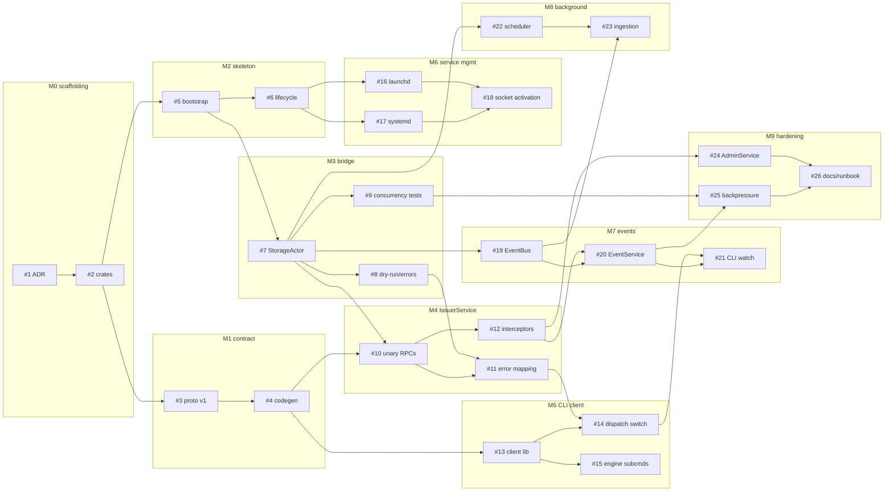

# Valqeron Engine — Developer Backlog

Implementation backlog for the background engine daemon described in
[`docs/architecture/engine.md`](../architecture/engine.md).

One file per work item, numbered `NNNN-slug.md`. Numbering matches the plan-local IDs in
engine.md §5. These are **not** GitHub issue numbers — see [Filing to GitHub](#filing-to-github).

## How to use this backlog

1. Find an item whose `depends_on` are all `status: done`. The [dependency graph](#dependency-graph)
   shows what is unblocked.
2. Set its front matter `status: in-progress` and put your handle in `assignee`.
3. Work the **Tasks** checklist; satisfy every **Acceptance criteria** bullet.
4. Set `status: done` in the same PR that lands the work.

Every item must satisfy the workspace's denied lints (`unwrap_used`, `expect_used`, `panic`,
`indexing_slicing`, `arithmetic_side_effects`, `as_conversions`, `todo`). The single documented
exception is generated protobuf code — see [#4](0004-codegen-and-mapping-layer.md).

## Front matter schema

```yaml
id: 7                    # plan-local ID, matches filename
title: "..."             # short imperative title
milestone: "M3 — ..."    # see milestones below
area: area:engine        # see label taxonomy
size: L                  # S | M | L | XL
risk: high               # optional: high | stretch
depends_on: [5]          # plan-local IDs that must land first
blocks: [8, 9, 10]       # inverse of depends_on, kept symmetric
status: todo             # todo | in-progress | done
assignee:                # github handle, empty until picked up
```

## Issue index

| # | Title | Milestone | Area | Size | Depends on | Status |
|---|---|---|---|---|---|---|
| [1](0001-adr-engine-architecture.md) | ADR: engine architecture decisions | M0 | docs | S | — | todo |
| [2](0002-workspace-scaffolding.md) | Workspace scaffolding for engine crates | M0 | engine | M | 1 | todo |
| [3](0003-proto-v1-definitions.md) | Proto v1 service and message definitions | M1 | proto | M | 2 | todo |
| [4](0004-codegen-and-mapping-layer.md) | Codegen pipeline and domain⇄proto mapping | M1 | proto | M | 3 | todo |
| [5](0005-daemon-binary-bootstrap.md) | Daemon binary bootstrap | M2 | engine | M | 2 | done |
| [6](0006-lifecycle-and-single-instance.md) | Lifecycle: single-instance guard and graceful shutdown | M2 | engine | L | 5 | done |
| [7](0007-storage-actor-core.md) | StorageActor core (async→sync bridge) ⚠️ | M3 | engine | L | 5 | todo |
| [8](0008-dry-run-and-error-taxonomy.md) | Dry-run support and error taxonomy | M3 | engine | M | 7 | todo |
| [9](0009-bridge-concurrency-tests.md) | Bridge concurrency tests ⚠️ | M3 | engine | M | 7 | todo |
| [10](0010-issuer-service-unary-rpcs.md) | IssuerService unary RPCs | M4 | engine | L | 4, 7 | todo |
| [11](0011-grpc-error-mapping.md) | gRPC error mapping | M4 | engine | M | 8, 10 | todo |
| [12](0012-interceptors-auth-tracing.md) | Interceptors: auth, request-id, tracing | M4 | engine | M | 10 | todo |
| [13](0013-valqeron-client-library.md) | `valqeron-client` library | M5 | client | M | 4 | todo |
| [14](0014-cli-dispatch-switch.md) | CLI dispatch switch (engine vs direct) | M5 | cli | L | 11, 13 | todo |
| [15](0015-cli-engine-subcommands.md) | `valqeron engine` subcommands (status, ping) | M5 | cli | S | 13 | todo |
| [16](0016-launchd-plist-macos.md) | launchd plist (macOS) | M6 | ops | M | 6 | in-progress |
| [17](0017-systemd-unit-linux.md) | systemd unit (Linux) | M6 | ops | S | 6 | in-progress |
| [18](0018-socket-activation.md) | Socket activation (stretch) | M6 | ops | M | 16, 17 | todo |
| [19](0019-event-bus.md) | EventBus | M7 | engine | M | 7 | todo |
| [20](0020-event-service-streaming.md) | EventService streaming | M7 | engine | L | 12, 19 | todo |
| [21](0021-cli-watch-command.md) | CLI `watch` command | M7 | cli | S | 14, 20 | todo |
| [22](0022-maintenance-scheduler.md) | Maintenance scheduler | M8 | engine | M | 7 | todo |
| [23](0023-ingestion-worker-stub.md) | IngestionWorker stub | M8 | engine | M | 19, 22 | todo |
| [24](0024-admin-service.md) | AdminService | M9 | engine | M | 12 | todo |
| [25](0025-backpressure-and-limits.md) | Backpressure and limits | M9 | engine | M | 9, 20 | todo |
| [26](0026-architecture-doc-and-runbook.md) | Architecture doc and ops runbook | M9 | docs | M | 24, 25 | todo |

⚠️ = `risk: high`. These carry the most design uncertainty; see the item body.

> **Re-sequencing note (minimal engine slice):** a minimal `valqeron-engine` shipped ahead of
> the M1/M3 contract-and-bridge work: #5 and #6 landed (socket tasks deferred with the gRPC
> edge), #16/#17 landed code-wise (manual service-manager checklists pending), and the engine
> runs periodic DB maintenance — the inline precursor of #22. During this phase the engine does
> **not** own the database exclusively; the CLI keeps direct access until #13/#14.

## Milestones

| ID | Name | Goal |
|---|---|---|
| M0 | Decisions & scaffolding | Open questions closed; crates exist and build. |
| M1 | Contract | `valqeron-proto` is the single source of truth for the wire format. |
| M2 | Engine daemon skeleton | Daemon starts, binds a socket, shuts down cleanly. |
| M3 | StorageActor bridge | Async gRPC edge can safely drive the blocking SQLite core. |
| M4 | IssuerService end-to-end | Real RPCs backed by real storage. |
| M5 | CLI client mode | `valqeron` talks to the daemon; first user-visible slice. |
| M6 | Service management | Daemon is installable and supervised on macOS and Linux. |
| M7 | Events | Change notifications stream to subscribers. |
| M8 | Background subsystem | Engine does useful work on its own schedule. |
| M9 | Admin, hardening, docs | Production-ready surface. |

## Critical path

```
#2 → #5 → #7 → #10 → #14
```

This is the shortest route to a working CLI → engine → SQLite round trip. It deliberately
front-loads [#7](0007-storage-actor-core.md), the async→sync bridge, which carries the most
design risk (see engine.md §2.1). Nothing in M7/M8 should start before this path is green.

**Parallelism:** M1 (contract) runs alongside M2 (skeleton). M6 (service management) runs
alongside M4/M5.

## Dependency graph



## Label taxonomy

**Area** — `area:proto`, `area:engine`, `area:client`, `area:cli`, `area:ops`, `area:docs`

**Size** — `S` (< half day), `M` (1–2 days), `L` (3–5 days), `XL` (> 1 week, should be split)

**Risk** — `risk:high` (design uncertainty, prototype first), `stretch` (deferrable without
blocking the milestone)

## Related upstream issues

The upstream repo (`lfreitas2012/valqeron`) has open issues that intersect this backlog. They
are cross-referenced from the relevant items rather than absorbed:

| Upstream | Subject | Intersects |
|---|---|---|
| [#4](https://github.com/lfreitas2012/valqeron/issues/4) | Periodic SQLite `PRAGMA optimize` for long-lived processes | [#22](0022-maintenance-scheduler.md) — largely satisfied by the scheduler; the daemon is exactly the "long-lived process" it anticipates |
| [#5](https://github.com/lfreitas2012/valqeron/issues/5) | Detect modified migration scripts via `schema_migrations` | [#7](0007-storage-actor-core.md) — the engine becomes the sole migration runner at startup |
| [#6](https://github.com/lfreitas2012/valqeron/issues/6) | Optional Litestream replication | [#22](0022-maintenance-scheduler.md), [#26](0026-architecture-doc-and-runbook.md) — interacts with WAL checkpoint scheduling |

## Filing to GitHub

This backlog is the source of truth. To mirror it as GitHub issues later:

- `lpfmongo/valqeron` (origin) is a fork with **issues disabled** — enable them first, or
- `lfreitas2012/valqeron` (upstream) has issues enabled, but the `lpfmongo` account has
  **read-only** access: it can open issues but cannot create milestones or apply labels.

The front matter is structured so a small `gh`-based script can create issues, milestones, and
labels from these files once a target repo is chosen. Decide the target in
[#1](0001-adr-engine-architecture.md).
