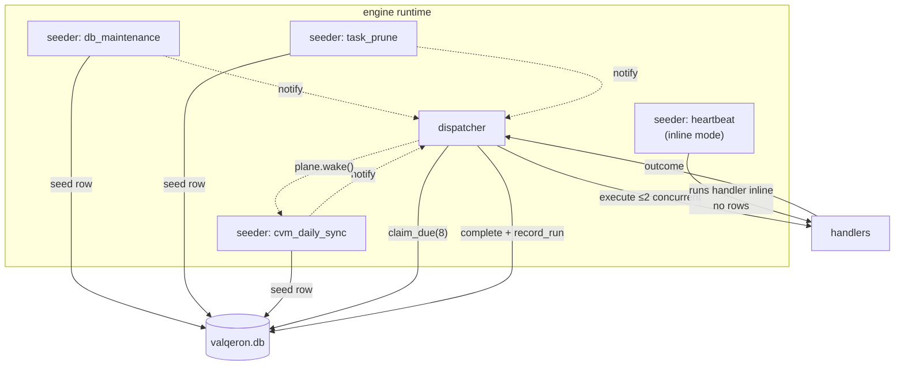

# Architecture

The framework is three layers with two hard boundaries. The point of the
boundaries is that **the task manager knows nothing about any individual task**,
and **tasks know nothing about scheduling**.

## The layer map

```text
═══════════ LAYER 1: TASK IMPLEMENTATIONS — the manager must NOT know these ═══════════
                                                                                       
  jobs/system.rs                     jobs/cvm.rs                    jobs/<future>.rs   
  ENGINE_SYSTEM                      FINANCE_DATA_SYNC              OTHER              
  db_maintenance, heartbeat,         CVM handler                    e.g. report_export 
  task_prune, sd_watchdog            + later: its own tables                           
                                       (migration + repo slot,                         
  each exports: register(builder)       referenced ONLY here)                          
        │                                   │                            │             
════════╪═══════════════════════════════════╪════════════════════════════╪════════════
        ▼   the ONLY contract: TaskSpec + Fn(TaskContext) -> TaskOutcome                
═══════════ LAYER 2: EXECUTION PLANES — tier semantics, pluggable ═════════════════════
                                                                                       
  plane/interval.rs         plane/recurring.rs          plane/sync.rs                  
  monotonic ticker,         wall-clock occurrence,      cursor-driven: catch-up,       
  durable | ephemeral       seed-ahead alarm            cooldown, halt, NotReady;      
                                                        owns sync_cursor + payload     
        │                          │                            │                      
        └────────────┬─────────────┴──────────────┬─────────────┘                      
                     ▼  trait Plane: cadence · mode · reconcile · window_for            
                        · interpret · on_terminal · wake                               
═══════════ LAYER 3: THE MANAGER — generic kernel, knows nothing above ════════════════
                                                                                       
   catalog reconcile     seeder loops            dispatcher           status read model
   (declare, retire,     (one per kind;          (claim, execute      (registration ⋈  
    cancel pending)       plane.reconcile         in task_run span,    rows ⋈ cursors  
                          behind paused gate)     record outcome)      → derive_status)
                                                                                       
═══════════════════════════ ENGINE DB (valqeron.db, WAL) ══════════════════════════════
   task_registration      background_task        sync_cursor        <task-owned tables>
   catalog + intent       queue + history        sync progress      invisible to L2/L3 
```

## Who may know what

| Layer | Knows | Must never know |
|---|---|---|
| **Manager** | kind, category, plane config, log policy, an opaque handler pointer | handler internals, payload formats, cursors, CVM, any task table |
| **Plane** | its own scheduling semantics and state table (sync → `sync_cursor`) | what handlers do, task-owned tables |
| **Task** | its handler, its config, its own tables | other tasks, manager internals |

This is enforced structurally, not by convention: `tasks/mod.rs` imports nothing
from `plane/sync.rs` beyond the `Plane` trait object, and nothing at all from
`jobs/`. A grep for `cvm` in `tasks/` returns only test fixture strings.

## The contract, in full

Everything crossing the Layer 1 ⇄ Layer 2 boundary:

```rust,ignore
// What a task hands the framework
TaskSpec {
    kind: &'static str,          // "cvm_daily_sync"
    category: TaskCategory,      // EngineSystem | FinanceDataSync | Other
    plane: PlaneConfig,          // Interval{..} | Recurring{..} | Sync{..}
    log_policy: LogPolicy,       // All | FailuresOnly
}

// What the framework hands a handler
TaskContext {
    storage: AsyncStorage,
    window: RunWindow,           // None | Period { slot, target }
}

// What a handler answers
enum TaskOutcome {
    Done,
    NotReady { retry_after_secs: u32 },
    Failed(String),
}
```

One handler signature for every task, in every plane. Handlers never parse
payloads — the plane does that once and hands over typed values in `window`.

`NotReady` is generic vocabulary with per-plane meaning: the sync plane holds
its cursor and starts a cooldown; the interval and recurring planes log and
continue, because their retry *is* the next occurrence.

## The `Plane` trait

The seam that erases tier-specific knowledge from the manager
(`crates/engine/src/tasks/plane/mod.rs`):

```rust,ignore
trait Plane: Send + Sync {
    fn cadence(&self) -> (tokio::time::Instant, Duration);
    fn mode(&self) -> TickMode;                    // Seed | Inline

    // Runs INSIDE the manager's single write transaction, after the
    // paused gate — so gate and insert cannot race.
    fn reconcile(&self, repos: &Repositories<..>, now) -> Result<SeedPass, StorageError>;

    fn window_for(&self, payload: Option<&str>) -> Result<RunWindow, String>;
    fn interpret(&self, storage, window, outcome) -> BoxFuture<Result<(), TaskFailure>>;
    fn on_terminal(&self, storage, error: String) -> BoxFuture<()>;
    fn wake(&self);
    fn wake_notified(&self) -> BoxFuture<()>;
}
```

Because `reconcile` receives the repositories and returns a verdict, the
manager can wrap it in a transaction and a pause check without understanding
what the plane did inside.

## Runtime topology

Each registration gets one seeder task; there is exactly one dispatcher.



Seeders and the dispatcher communicate through two notifications: a seeder that
inserted a row wakes the dispatcher immediately (instead of waiting for the 1s
poll), and a completed run wakes its plane's seeder (so catch-up is paced by
handler speed, not the 60s tick).

## Module layout

```text
crates/engine/src/
├── tasks/
│   ├── mod.rs              manager kernel — generic
│   └── plane/
│       ├── mod.rs          trait Plane, contract types, PlaneConfig
│       ├── interval.rs     monotonic ticks
│       ├── recurring.rs    wall-clock occurrences
│       └── sync.rs         cursor-driven with catch-up
├── jobs/
│   ├── mod.rs
│   ├── system.rs           ENGINE_SYSTEM tasks
│   └── cvm.rs              FINANCE_DATA_SYNC: CVM
└── engine.rs               composition only:
                            jobs::system::register(..) → jobs::cvm::register(..)

crates/core/src/
├── task.rs                 BackgroundTask entity, retry arithmetic
├── task_registration.rs    catalog entity + derive_status
├── sync.rs                 SyncCursor, outcomes, cooldown policy
├── schedule.rs             Recurrence, Schedule, TargetPeriod
└── calendar.rs             MarketCalendar, business-day math
```

`core` holds every pure decision (business-day math, retry backoff, cooldown
growth, status derivation) so it stays unit-testable and free of tokio — a
constraint enforced by `just deps-check`. The engine owns the clocks, the loops,
and the I/O.

## Why the boundaries pay off

Adding a second data source (ANBIMA, B3, SEC) touches **one new file** plus one
line of composition. The manager, the planes, the catalog, the dispatcher, and
the status model are all unchanged — and the new source immediately inherits
catch-up, cooldowns, pause/resume, status derivation, and log filtering.

See [Adding a Task](./adding-a-task.md) for the walkthrough.
