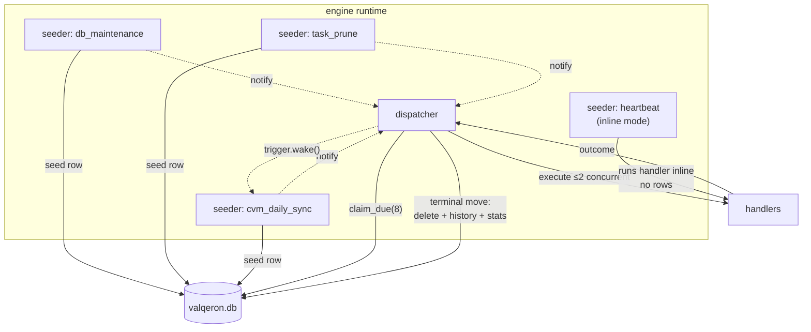
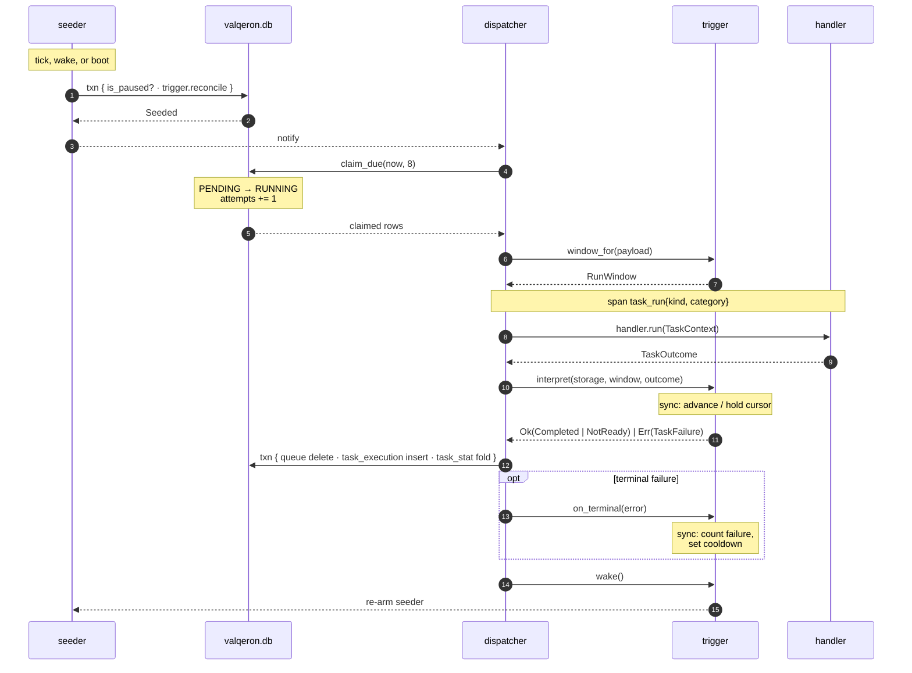
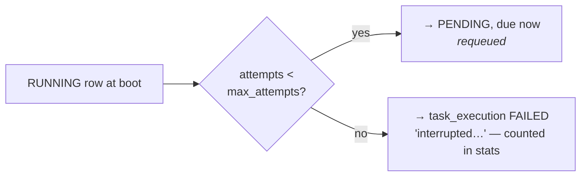

# Architecture

Three layers, two hard boundaries: **the manager knows nothing about any individual task**, and **tasks know nothing
about scheduling**. Adding a data source (ANBIMA, B3, SEC) is one new file plus one composition line — it inherits
catch-up, cooldowns, pause/resume, status, and log filtering unchanged.

`crate::tasks` is the feature's only door. Jobs and the engine composition see the façade — `BackgroundTasks`,
`TaskDefinition` builders, and the handler contract — and nothing else; the `trigger` module is private.

```text
═══════════ LAYER 1: TASK IMPLEMENTATIONS — the manager must NOT know these ═══════════
                                                                                       
  jobs/system.rs                     jobs/cvm.rs                    jobs/<future>.rs   
  ENGINE_SYSTEM                      FINANCE_DATA_SYNC              OTHER              
  db_maintenance, heartbeat,         CVM handler                    e.g. report_export 
  task_prune, sd_watchdog            + later: its own tables                           
                                       (migration + repo slot,                         
  each exports: register(builder)       referenced ONLY here)                          
        │                                   │                            │             
════════╪═══════════════════════════════════╪════════════════════════════╪════════════
        ▼   the ONLY contract: TaskDefinition (builder) + TaskHandler                   
═══════════ LAYER 2: TRIGGERS — scheduling semantics, private module ══════════════════
                                                                                       
  trigger/interval.rs       trigger/recurring.rs        trigger/sync.rs                
  monotonic ticker,         wall-clock occurrence,      cursor-driven: catch-up,       
  durable | ephemeral       seed-ahead alarm            cooldown, halt, NotReady;      
                                                        owns sync_cursor + payload     
        │                          │                            │                      
        └────────────┬─────────────┴──────────────┬─────────────┘                      
                     ▼  trait Trigger: cadence · mode · reconcile · window_for          
                        · interpret · on_terminal · wake                               
═══════════ LAYER 3: THE RUNTIME — generic, knows nothing above ═══════════════════════
                                                                                       
   BackgroundTasks(Builder)   TaskWorkerManager        TaskContextRunner               
   catalog reconcile,         one stoppable seeder     storage gateway; seed passes,   
   crash recovery,            loop per kind + the      claim, execute in task_run      
   start/drain facade,        dispatcher; per-task     spans, terminal move, trigger   
   stop/start/kick/statuses   stop · start · drain     hooks                           
                                                                                       
═══════════════════════════ ENGINE DB (valqeron.db, WAL) ══════════════════════════════
  task_registry     task_queue      task_execution   task_stat      <task-owned tables>
  catalog + intent  live work only  run history      aggregates,    invisible to L2/L3 
                                    (pruned @ 7d)    never pruned                      
```

| Layer | Knows | Must never know |
|---|---|---|
| **Runtime** | kind, category, trigger config, log policy, an opaque `Arc<dyn TaskHandler>` | handler internals, payload formats, cursors, CVM, any task table |
| **Trigger** | its own scheduling semantics and state table (sync → `sync_cursor`) | what handlers do, task-owned tables |
| **Task** | its handler, its config, its own tables | other tasks, runtime internals |

Enforced structurally, not by convention: the `trigger` module is private to `tasks/`, `tasks/` imports nothing from
`jobs/`, and a grep for `cvm` in `tasks/` returns only test fixture strings. `core` holds every pure decision
(business-day math, retry backoff, cooldown growth, status derivation) in one module — `core/src/tasks/` — and stays
tokio-free, enforced by `just deps-check`; the engine owns the clocks, the loops, and the I/O.

## The contract

Everything crossing the Layer 1 ⇄ Layer 2 boundary:

```rust,ignore
// How a task runs: object-safe, so trivial tasks stay closures (blanket
// impl) and stateful ones implement it on a struct.
trait TaskHandler: Send + Sync + 'static {
    fn run<'a>(&'a self, ctx: TaskContext) -> BoxFuture<'a, TaskOutcome>;
}

// What the framework hands a handler
TaskContext {
    storage: AsyncStorage,
    window: RunWindow,           // None | Period { slot, target }
}

// What a handler answers
enum TaskOutcome {
    Done,
    NotReady { retry_after_secs: u32 },
    Failed(String),
}
```

One handler contract for every task under every trigger. Handlers never parse payloads — the trigger does that once
and hands over typed values in `window`. What a task *is* travels as a `TaskDefinition`, produced by one typed builder
per trigger kind (see [Adding a Task](./adding-a-task.md)); the builders carry the framework defaults and also produce
the catalog declaration for env-disabled tasks (`.disabled()`), so there is one source of truth for both paths.

The seam that erases trigger-specific knowledge from the runtime is the `Trigger` trait
(`crates/engine/src/tasks/trigger/mod.rs`):

```rust,ignore
trait Trigger: Send + Sync {
    fn cadence(&self) -> (tokio::time::Instant, Duration);
    fn mode(&self) -> TickMode;                    // Seed | Inline

    // Runs INSIDE the runner's single write transaction, after the
    // paused gate — so gate and insert cannot race.
    fn reconcile(&self, repos: &Repositories<..>, now) -> Result<SeedPass, StorageError>;

    fn window_for(&self, payload: Option<&str>) -> Result<RunWindow, String>;
    // Ok carries what the history records: Completed or NotReady.
    fn interpret(&self, storage, window, outcome) -> BoxFuture<Result<Interpretation, TaskFailure>>;
    fn on_terminal(&self, storage, error: String) -> BoxFuture<()>;
    fn wake(&self);
    fn wake_notified(&self) -> BoxFuture<()>;
}
```

Because `reconcile` receives the repositories and returns a verdict, the runner can wrap it in a transaction and a
pause check without understanding what the trigger did inside.

## Runtime topology

Each registration gets one seeder loop — individually stoppable via `BackgroundTasks::stop/start(kind)` — and there is
exactly one dispatcher.



Two notifications replace polling: a seeder that inserted a row wakes the dispatcher immediately (instead of its
1-second poll), and a completed run wakes its trigger's seeder (so catch-up is paced by handler speed, not the
60-second tick).

## The data model

One concern per table; a terminal run **moves** rather than mutates in place:

```text
┌─ task_registry ─────────────┐   ┌─ task_queue ────────────────┐
│ catalog + operator intent   │   │ LIVE work only              │
│ declaration (code-owned,    │   │ status ∈ PENDING | RUNNING  │
│  overwritten at boot):      │   │ attempts/max, retry delay,  │
│  category trigger_kind      │   │ payload, version guard      │
│  tracking schedule source   │   │ rows leave on completion ──┐│
│  log_policy config_enabled  │   └─────────────────────────── ││
│ intent (preserved): paused, │                    terminal move│
│  registered                 │   ┌─ task_execution ───────────▼┐
└─────────────────────────────┘   │ history: 1 row per terminal │
┌─ task_stat ─────────────────┐   │  run; outcome ∈ SUCCEEDED | │
│ prune-proof aggregates:     │◄──│  NOT_READY | FAILED;        │
│ totals, durations, last_*   │   │  attempts, duration_ms      │
│ NEVER pruned                │   │ pruned after 7 days         │
└─────────────────────────────┘   └─────────────────────────────┘
          sync_cursor — per-source progress, never pruned
```

```sql
CREATE TABLE task_registry (
    kind                TEXT NOT NULL PRIMARY KEY,
    category            TEXT NOT NULL,   -- ENGINE_SYSTEM|FINANCE_DATA_SYNC|OTHER
    trigger_kind        TEXT NOT NULL,   -- INTERVAL|RECURRING|SYNC
    tracking            TEXT NOT NULL,   -- DURABLE|EPHEMERAL
    schedule            TEXT NOT NULL,   -- display-only descriptor, never parsed back
    source              TEXT,            -- sync trigger: the sync_cursor key
    log_policy          TEXT NOT NULL DEFAULT 'ALL',
    config_enabled      INTEGER NOT NULL DEFAULT 1,   -- env verdict
    paused              INTEGER NOT NULL DEFAULT 0,   -- operator intent
    registered          INTEGER NOT NULL DEFAULT 1,   -- 0 = retired
    first_registered_at TEXT NOT NULL,
    updated_at          TEXT NOT NULL
) STRICT, WITHOUT ROWID;
```

Facts that matter:

- **`runs = registered && config_enabled && !paused`.** Three switches, deliberately distinct: *"does the code still
  ship this?"*, *"is this deployment configured for it?"*, *"did someone temporarily stop it?"*.
- **Every catalog column has one owner.** Declaration columns are rewritten by the boot reconcile; only `paused`
  survives it. Run aggregates live on `task_stat`, so the reconcile never has to tiptoe around columns it does not own.
- **`task_stat` is the prune-proof memory.** `task_prune` deletes `task_execution` rows after 7 days; the stats row —
  totals, failure counts, durations, `last_success_at` — is never deleted and survives retirement, exactly like the
  sync cursor.
- **Disabled is still declared.** A task configured off via env gets a catalog row (`config_enabled = 0`) through the
  builder's `.disabled()` terminal, so an operator can tell "off by config" from "never existed" — history, stats, and
  cursor stay intact for re-enabling.

### Boot reconcile

Once at startup, in one write transaction, **after** crash recovery (so a retired kind's requeued rows get cancelled
too):

```mermaid
sequenceDiagram
    participant B as builder.start()
    participant R as recover_stale_running
    participant T as reconcile_registry (1 txn)
    participant DB as valqeron.db

    B->>R: RUNNING rows are orphans
    R->>DB: requeue (attempts left), or move to<br/>task_execution as FAILED + count in stats
    B->>T: declarations from code
    loop each declaration
        T->>DB: declare (upsert; preserve paused)
    end
    T->>DB: retire_missing(kinds) → retired[]
    loop each retired kind
        T->>DB: take_pending → task_execution rows<br/>("retired: kind no longer registered")
    end
    T-->>B: declared / retired / cancelled counts
    B->>B: spawn seeders + dispatcher
```

**Retirement, not deletion.** A kind that disappears from code is marked `registered = 0`; its catalog row and stats
survive forever, and its leftover `PENDING` rows move to the history as failed — recorded as cancellations, **not**
counted in the stats (a row that never ran is not a run). A kind that comes back is revived by the next `declare` with
its totals intact.

> **Renaming a kind is retire + create.** Run totals restart. Sync *progress* does not, because `sync_cursor` is keyed
> by `source`, not by task kind.

### Why one file

The engine tables live in the **same SQLite file** as domain data. That is a correctness requirement, not convenience:
WAL mode cannot commit atomically across attached database files. One file is what allows an ingesting handler to write
its data *and* advance its cursor in a single transaction — the exactly-once seam. A separate `engine.db` would
permanently foreclose that.

## Lifecycle of a run



The non-obvious guarantees at each stage:

| Stage | Guarantee |
|---|---|
| Seed (1–3) | Pause gate and `trigger.reconcile` share **one write transaction** — they cannot race |
| Claim (4–6) | Select-then-claim under one writer guard; the per-row `WHERE status='PENDING'` guard makes double-dispatch impossible; batch runs at `EXECUTION_CONCURRENCY = 2` *across* kinds, serial within one |
| Execute (7–10) | Handler runs inside a `task_run{kind, category}` span; sees typed `RunWindow`, never a payload |
| Interpret (11–12) | Trigger applies its side effects and reports what the history should record — `NotReady` is a first-class result ("waited" is not "worked"), never a failure; a failed cursor write turns a successful handler into a failed run |
| Complete (13) | The terminal **move** is one transaction: version-guarded queue `DELETE`, `task_execution` `INSERT`, `task_stat` fold — applied only when the guarded delete matched. Retries stay in the queue as an `UPDATE`; only terminal outcomes reach history and stats |
| Hooks (14–16) | `on_terminal` lets the trigger count failures / set cooldowns, then `wake()` re-arms the seeder within milliseconds |

### Retries, crash recovery, shutdown

Retries live on the queue row itself:

```text
attempts < max_attempts  →  TaskCompletion::Retry
                            status → PENDING
                            scheduled_at = now + retry_delay_secs · 2^(attempts−1)
                            capped at MAX_BACKOFF = 1 hour

attempts = max_attempts  →  TaskCompletion::Terminal  (row moves to history)
```

With `retry_delay_secs = 300` and 3 attempts: fail → +5 min → fail → +10 min → fail → terminal.

At boot, `RUNNING` rows are orphans by definition (the single-instance lock guarantees no other process owns them):



Shutdown is bounded and symmetric with crash recovery:

```text
SIGTERM / SIGINT
   │
   ├─ lifecycle → Stopping (sd_notify STOPPING=1)
   ├─ gRPC server stops accepting, drains in-flight RPCs
   ├─ BackgroundTasks::drain — watch flip stops every seeder + the dispatcher
   ├─ bounded drain (DRAIN_TIMEOUT = 10s) waits for running handlers
   └─ storage closed, runtime shut down (RUNTIME_SHUTDOWN_TIMEOUT = 20s)
```

A handler cut off by the drain deadline leaves its row `RUNNING` — exactly the crash-recovery case, handled at the next
boot.
