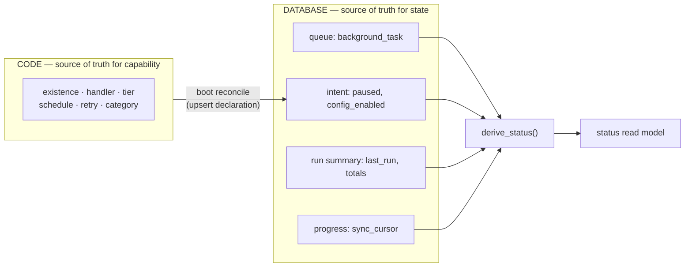
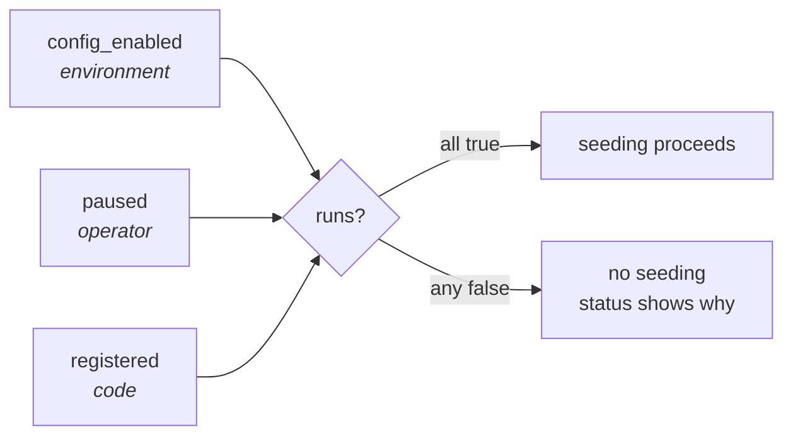

# The Task Catalog

`task_registration` is the durable answer to "what tasks exist, and what is
their operational state?". One row per task kind, reconciled from code at every
boot.

## Two sources of truth

Handlers are code — they can never live in a database. So the catalog is *not*
the source of what is executable. The split follows the declared/observed
pattern:



The three column groups on a registration row:

| Group | Columns | Owner | Boot reconcile |
|---|---|---|---|
| **Declaration** | `category`, `tier`, `tracking`, `schedule`, `source`, `log_policy`, `config_enabled` | code | **overwritten** |
| **Intent** | `paused` | operator | **preserved** |
| **Run summary** | `last_run_at`, `last_outcome`, `last_error`, `total_runs`, `total_failures` | manager | **preserved** |

## Schema

```sql
CREATE TABLE task_registration (
    kind                TEXT NOT NULL PRIMARY KEY,
    category            TEXT NOT NULL,   -- ENGINE_SYSTEM|FINANCE_DATA_SYNC|OTHER
    tier                TEXT NOT NULL,   -- INTERVAL|RECURRING|SYNC
    tracking            TEXT NOT NULL,   -- DURABLE|EPHEMERAL
    schedule            TEXT NOT NULL,   -- display-only descriptor
    source              TEXT,            -- sync tier: the sync_cursor key
    log_policy          TEXT NOT NULL DEFAULT 'ALL',
    config_enabled      INTEGER NOT NULL DEFAULT 1,   -- env verdict
    paused              INTEGER NOT NULL DEFAULT 0,   -- operator intent
    registered          INTEGER NOT NULL DEFAULT 1,   -- 0 = retired
    last_run_at         TEXT,
    last_outcome        TEXT,            -- SUCCEEDED|FAILED
    last_error          TEXT,
    total_runs          INTEGER NOT NULL DEFAULT 0,
    total_failures      INTEGER NOT NULL DEFAULT 0,
    first_registered_at TEXT NOT NULL,
    updated_at          TEXT NOT NULL
) STRICT, WITHOUT ROWID;
```

`schedule` is a canonical descriptor the engine writes and humans read —
`interval:3600s±10%`, `recurring:daily@03:00+00:00`, `sync:daily@07:00-03:00`.
It is deliberately opaque and never parsed back, so changing schedule internals
needs no migration.

### Why the run summary is denormalised

`task_prune` deletes terminal `background_task` rows after **7 days**. Without
`last_run_at` and the totals on the registration, a healthy weekly task would
show *no history at all* one week after its last run. The registration row is
the prune-proof memory — the same reasoning behind `sync_cursor`.

## Two switches, deliberately distinct



`runs = registered && config_enabled && !paused`. They answer different
questions — *"is this deployment configured to sync CVM?"* versus *"did someone
temporarily stop it?"* — and collapsing them would lose the distinction the
status display needs.

## Boot reconcile

Runs once at startup, in one write transaction, **after** crash recovery (so a
retired kind's requeued rows get cancelled too):

```mermaid
sequenceDiagram
    participant B as builder.start()
    participant R as recover_stale_running
    participant T as reconcile_registry (1 txn)
    participant DB as valqeron.db

    B->>R: RUNNING rows are orphans
    R->>DB: requeue (attempts left) or fail
    B->>T: declarations from code
    loop each declaration
        T->>DB: declare (upsert; preserve paused + summary)
    end
    T->>DB: retire_missing(kinds) → retired[]
    loop each retired kind
        T->>DB: fail_pending("retired: kind no longer registered")
    end
    T-->>B: declared / retired / cancelled counts
    B->>B: spawn seeders + dispatcher
```

The audit line:

```text
operation="task_registry_reconcile" declared=5 retired=1 cancelled_rows=1
    retired_kinds=["old_cleanup"] "task catalog reconciled"
```

### Retirement, not deletion

A kind that disappears from code is marked `registered = 0`; its row and its
entire run summary survive forever. Its leftover `PENDING` rows are terminally
failed with `"retired: kind no longer registered"` — so nothing later fails with
the confusing `"no handler registered"` and the history stays truthful.

A kind that comes *back* in a later version is revived by the next `declare`,
with its historical totals intact.

> **Renaming a kind is retire + create.** The old row retires and a new one
> starts fresh, so run totals restart. Sync *progress* does not, because
> `sync_cursor` is keyed by `source`, not by task kind.

## Disabled-but-declared

A task configured off via the environment still gets a catalog row, via
`declare_disabled`:

```rust,ignore
// jobs/cvm.rs — when config.cvm_sync() is None
builder.declare_disabled(TaskDeclaration {
    kind, category, tier, tracking, schedule, source,
    log_policy,
    config_enabled: false,   // ← the whole point
})
```

Without this, disabling CVM would make it vanish from the catalog entirely and
an operator could not tell "off by config" from "never existed". With it, the
status is a visible `disabled`, and history plus cursor stay intact for
re-enabling later.

## Why one file

`task_registration`, `background_task`, and `sync_cursor` are engine-internal
tables, but they live in the **same SQLite file** as domain data.

That is a correctness requirement, not convenience: SQLite in WAL mode **cannot
commit atomically across attached database files**. Keeping engine state in one
file is what allows a future ingesting handler to write its data *and* advance
its cursor in a single transaction — the exactly-once seam. Splitting into a
separate `engine.db` would permanently foreclose that.

## Inspecting it

```sql
SELECT kind, category, tier, schedule,
       config_enabled, paused, registered,
       last_run_at, last_outcome, total_runs, total_failures
FROM task_registration
ORDER BY category, kind;
```

For the derived status of each task rather than raw columns, see
[Status Model](./status.md).
