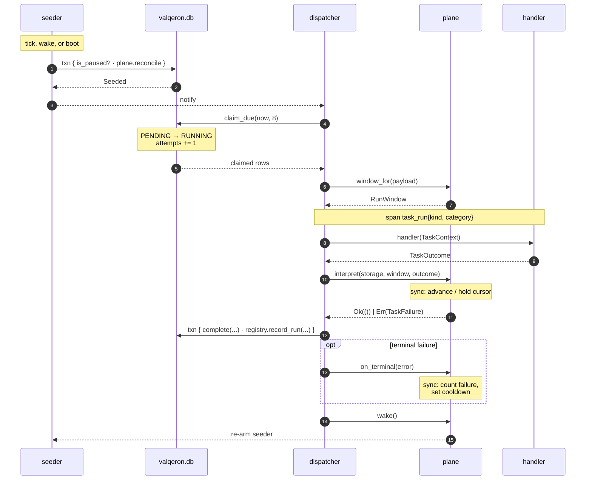
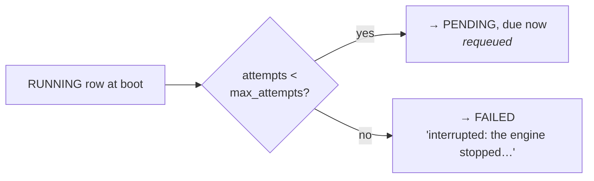

# Lifecycle of a Run

End to end, from seeding to recorded outcome.

## The full path



## Stage by stage

### 1. Seeding

The seeder wakes on its ticker, on a plane wake (a completed run), or at boot.
One write transaction covers the pause gate *and* the plane's reconcile, so they
cannot race. A `Seeded` verdict notifies the dispatcher immediately rather than
waiting for its 1-second poll.

### 2. Claiming

```text
drain_due loop:
    claim_due(now, CLAIM_BATCH = 8)
        SELECT id FROM background_task
        WHERE status = 'PENDING' AND scheduled_at <= now
        ORDER BY scheduled_at, id LIMIT 8
    → per id: UPDATE … SET status='RUNNING', attempts = attempts + 1
              WHERE id = ? AND status = 'PENDING'      ← idempotent guard
```

Select-then-claim runs under one writer guard, so the batch is atomic. The
per-row `status = 'PENDING'` guard makes double-dispatch impossible even if the
logic above it were wrong.

The batch executes with `EXECUTION_CONCURRENCY = 2` — parallelism *across*
kinds. Within one kind the `exists_active` gate already guarantees serial
execution.

### 3. Execution

The dispatcher asks the plane to decode the payload, then runs the handler
inside a `task_run{kind, category}` span. Handlers cannot see payloads, and the
manager cannot see what handlers do — the two boundaries meet here.

### 4. Interpretation

`plane.interpret(...)` applies tier side effects and converts the outcome into
a plain `Result`:

| | `Ok(())` | `Err(TaskFailure)` |
|---|---|---|
| Interval / Recurring | `Done`, `NotReady` | `Failed` |
| Sync | `Done` (cursor advanced), `NotReady` (cursor held) | `Failed`, or a cursor-write error |

A cursor write that fails turns a successful handler into a failed run —
deliberately. Re-running a synced period is safe; silently losing the advance
is not.

### 5. Completion

```rust,ignore
storage.write("task_complete", false, |repos| {
    repos.tasks.complete(&id, version, completion)?;   // version-guarded
    if terminal && registered {
        repos.registry.record_run(&kind, outcome, error, now)?;
    }
})
```

Both writes in **one transaction**: the queue row and the catalog's prune-proof
summary can never disagree.

Only *terminal* completions reach the catalog. A retry leaves the row active and
does not inflate `total_runs`; attempt-level detail stays on the row.

### 6. Hooks

`on_terminal` gives the plane its last word (the sync plane counts the failure
and starts the cooldown), then `wake()` re-arms the seeder so the next
occurrence — or the retry of this one — is queued in milliseconds.

## Retries and backoff

Retries live on the row itself:

```text
attempts < max_attempts  →  TaskCompletion::Retry
                            status → PENDING
                            scheduled_at = now + retry_delay_secs · 2^(attempts−1)
                            capped at MAX_BACKOFF = 1 hour

attempts = max_attempts  →  TaskCompletion::Failed  (terminal)
```

With `retry_delay_secs = 300` and 3 attempts: fail → +5 min → fail → +10 min →
fail → terminal.

A zero base delay retries immediately, picked up by the same `drain_due` loop.

## Crash recovery

At boot, before anything else, `RUNNING` rows are orphans by definition — the
single-instance lock guarantees no other process owns them.



Recovery runs **before** the catalog reconcile, so a retired kind's requeued
rows are then cancelled by the retirement step rather than being dispatched into
a missing handler.

## Shutdown

```text
SIGTERM / SIGINT
   │
   ├─ lifecycle → Stopping (sd_notify STOPPING=1)
   ├─ gRPC server stops accepting, drains in-flight RPCs
   ├─ task manager: watch flip stops every seeder + the dispatcher
   ├─ bounded drain (DRAIN_TIMEOUT = 10s) waits for running handlers
   └─ storage closed, runtime shut down (RUNTIME_SHUTDOWN_TIMEOUT = 20s)
```

A handler cut off by the drain deadline leaves its row `RUNNING` — which is
exactly the crash-recovery case, handled at the next boot.
