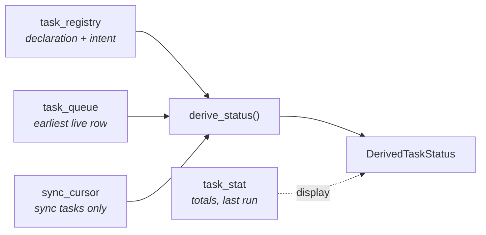

# Operations

Running, tuning, and troubleshooting the task framework.

## Configuration

All configuration is environment variables, set in the service definition (`scripts/install/*.example`). Unset or empty
means "use the default"; a *set, non-empty, invalid* value makes the engine **refuse to start** — a misconfiguration
must never silently become a default.

| Variable | Default | Meaning |
|---|---|---|
| `VALQERON_ENGINE_MAINTENANCE_INTERVAL` | `3600` | `db_maintenance` period, seconds |
| `VALQERON_ENGINE_HEARTBEAT_INTERVAL` | `300` | `heartbeat` period, seconds |
| `VALQERON_ENGINE_LOG_LEVEL` | `info` | JSON file-log filter (see below) |
| `VALQERON_ENGINE_LOG_FILE` | `<data>/engine.log` | `off`/`false`/`0`/`none` disables |

Sync sources are namespaced per source, so adding a source adds a namespace:

| Variable | Default | Meaning |
|---|---|---|
| `VALQERON_ENGINE_SYNC_CVM` | enabled | `off`/`false`/`0`/`none` disables |
| `VALQERON_ENGINE_SYNC_CVM_AT` | `07:00` | market-local `HH:MM` |
| `VALQERON_ENGINE_SYNC_CVM_SCHEDULE` | `daily` | `daily` or `weekly:<mon..sun>` |
| `VALQERON_ENGINE_SYNC_CVM_COOLDOWN` | `300` | failure-cooldown base, seconds |
| `VALQERON_ENGINE_SYNC_MAX_BACKFILL_DAYS` | `90` | unattended catch-up bound |

Disabling a source does not erase it: the catalog keeps a row with `config_enabled = 0`, status `disabled`, and its
cursor, stats, and history intact.

## Status

A task's status is **never stored** — it is derived on every read by `derive_status`, a pure function in
`crates/core/src/tasks/mod.rs` (no clock, no I/O, exhaustively unit-tested), so it cannot go stale. In-process,
`BackgroundTasks::statuses()` assembles the full view (registration + status + next run + stats + cursor).



First match wins — the order encodes precedence (operator/config decisions beat queue contents; "executing right now"
beats sync detail; `halted` is the escalated form of `cooling_down`):

| # | Status | Condition |
|---|---|---|
| 1 | `retired` | `registered = 0` |
| 2 | `disabled` | `config_enabled = 0` |
| 3 | `paused` | `paused = 1` |
| 4 | `running` | a queue row is `RUNNING` |
| 5 | `halted` | sync: `consecutive_failures ≥ 5` |
| 6 | `cooling_down` | sync: `cooldown_until > now` |
| 7 | `catching_up` | sync: a queued row is past due |
| 8 | `waiting` | queued row `scheduled_at > now` |
| 9 | `due` | queued row past due (non-sync) |
| 10 | `idle` | nothing queued — normal for ephemeral tasks, transient for durable ones |

A healthy engine mid-morning on a Wednesday, and the same engine after CVM has been failing:

| kind | status | next run | last run | outcome | runs/fails |
|---|---|---|---|---|---|
| `db_maintenance` | `waiting` | 12:38Z | 11:41Z | SUCCEEDED | 162/0 |
| `heartbeat` | `idle` | — | — | — | — |
| `task_prune` | `waiting` | Thu 03:00Z | Wed 03:00Z | SUCCEEDED | 7/0 |
| `cvm_daily_sync` | **`halted`** | after cooldown | 07:00 BRT | FAILED | 31/5 — `last_error="connect timeout"` |
| `old_cleanup` | `retired` | — | Aug 12 | SUCCEEDED | 41/2 — preserved after removal from code |

Until the `ListTasks` RPC and `vq engine tasks` land, the raw joins:

```sql
-- catalog + stats + next run
SELECT r.kind, r.category, r.schedule,
       r.registered, r.config_enabled, r.paused,
       s.last_outcome, s.total_runs, s.total_failures, s.last_success_at,
       (SELECT MIN(scheduled_at) FROM task_queue q
         WHERE q.kind = r.kind AND q.status = 'PENDING') AS next_run_at
FROM task_registry r
LEFT JOIN task_stat s ON s.kind = r.kind
ORDER BY r.category, r.kind;

-- recent runs (history, pruned after 7 days)
SELECT kind, outcome, finished_at, attempts, duration_ms, error
FROM task_execution
ORDER BY finished_at DESC
LIMIT 20;

-- sync detail
SELECT source, through_slot, through_target,
       consecutive_failures, cooldown_until, last_outcome, last_error
FROM sync_cursor;
```

## Pause, resume, and worker control

`paused` is operator intent, persisted across restarts and independent of configuration. Pause stops the *scheduler*,
not the *runtime* — restarting the engine is never required in either direction.

```text
pause  ─► stops SEEDING within ≤60s (the seeder's fallback tick)
       ─► an already-armed row still fires
       ─► an in-flight run finishes normally

resume ─► seeding restarts at the next tick
       ─► sync sources catch up sequentially from the cursor
```

> **Interim story:** there is no CLI or RPC yet, so pause is flipped by writing the row directly. This is safe against
> a live engine — WAL mode plus the repositories' busy-retry handle the concurrency.

```sql
UPDATE task_registry
   SET paused = 1,   -- 0 to resume
       updated_at = strftime('%Y-%m-%dT%H:%M:%fZ','now')
 WHERE kind = 'cvm_daily_sync';
```

A paused-then-resumed sync source costs nothing extra: resume walks the missed periods in order through exactly the
same catch-up path as an outage. **Ephemeral tasks ignore `paused`** — `heartbeat` and `sd_watchdog` are liveness work;
pausing the watchdog would let systemd's `WatchdogSec` kill the engine.

In-process, `BackgroundTasks` additionally exposes **runtime worker control** — `stop(kind)` / `start(kind)` halt and
respawn one kind's seeder loop (same semantics as `paused`: armed rows still fire), and `kick(kind)` wakes a seeder
immediately instead of waiting its fallback tick. These are the building blocks for the pause RPC: flip the flag, then
kick.

## Logging control

Three independent dials, no bespoke machinery:

| Dial | Mechanism | Example |
|---|---|---|
| Structured context | every run is inside `task_run{kind, category}`; audit events carry the category | `task_run{kind="cvm_daily_sync", category="FINANCE_DATA_SYNC"}` |
| `EnvFilter` per task/category | span-scoped directives in `VALQERON_ENGINE_LOG_LEVEL` (file log) or `RUST_LOG` (stderr) | `'info,[task_run]=debug'` · `'info,[task_run{category=FINANCE_DATA_SYNC}]=trace'` |
| `log_policy` per task | `ALL` logs every run-finished line; `FAILURES_ONLY` logs failures only (failures are **always** logged) | defaults: `FAILURES_ONLY` for ephemeral tasks, `ALL` otherwise |

Audit events all carry `target = "valqeron::audit"` and appear in the JSON file log (the CLI suppresses this target on
stderr):

| `operation` | Emitted when |
|---|---|
| `task_registry_reconcile` | boot; declared / retired / cancelled counts |
| `task_seed` | recurring trigger armed the next occurrence |
| `sync_seed` | sync trigger seeded a run (with `pending_days`) |
| `sync_not_ready` | source has not published yet |
| `sync_skip` | stale cursor clamped, history skipped |
| `sync_halted` | terminal failure; `warn`, escalating to `error` at 5 |
| `task_run` | a run finished (subject to `log_policy`; outcome `succeeded`/`not_ready`/`retry`/`failed`) |
| `task_recovery` | boot requeued/recorded orphaned `RUNNING` rows |
| `task_prune` | history rows deleted |
| `db_maintenance` | WAL checkpoint + optimize |

## Troubleshooting

**A task is not running:**

```sql
SELECT r.registered, r.config_enabled, r.paused, s.last_outcome, s.last_error
FROM task_registry r LEFT JOIN task_stat s ON s.kind = r.kind
WHERE r.kind = '<kind>';
```

| Symptom | Cause | Fix |
|---|---|---|
| `registered = 0` | kind removed from code | expected after an upgrade |
| `config_enabled = 0` | disabled by env | unset the `*_SYNC_*` off-value |
| `paused = 1` | operator paused it | resume (above) |
| all clean, no rows | possibly cooling down | check `sync_cursor` |

**A sync source is stuck** — query `sync_cursor` (see [Status](#status)):

| Observation | Meaning |
|---|---|
| `consecutive_failures ≥ 5` | **halted**: the same period retries after each cooldown, nothing after it runs; the next success clears the counter and catch-up resumes |
| `last_outcome = 'NOT_READY'` | source has not published yet — normal; retries after `cooldown_until` |
| `through_target` far behind | catch-up in progress, or the gap exceeded `max_backfill_days` and was skipped (look for `operation="sync_skip"`) |

**Rows are piling up** — they should not: every durable trigger gates on `exists_active`, and terminal runs leave the
queue entirely. More than a handful of `task_queue` rows means rows were inserted outside the framework
(`SELECT kind, status, COUNT(*) FROM task_queue GROUP BY kind, status;`).

**History is missing** — `task_prune` deletes `task_execution` rows after 7 days. Long-term facts live on `task_stat`
(totals, failure counts, `last_success_at`, durations) precisely because history does not survive.

**Backups:** `task_registry`, `task_stat`, and `sync_cursor` are part of the engine's operational state. Restoring a
ten-day-old backup makes sources catch up ten days of periods (bounded by `max_backfill_days`).

## Scenarios

Each is covered by an automated test; the mechanics behind them are in [Triggers](./triggers.md) and
[Architecture](./architecture.md).

| Scenario | What happens | Test |
|---|---|---|
| **Ten-day outage** | Every missed business day synced in order, one at a time, paced by handler speed; then the future slot is armed | `ten_missed_business_days_backfill_sequentially_in_order` |
| **Pause Tue, resume Fri** | Wed's already-armed row still fires; no seeding while paused; resume walks Thu+Fri via the normal catch-up path, `paused → catching_up → waiting` within a minute | `paused_source_resumes_with_sequential_catchup`, `paused_kind_seeds_nothing_until_resumed` |
| **Disabled by config** (`VALQERON_ENGINE_SYNC_CVM=off`) | Catalog row stays visible as `disabled` via the builder's `.disabled()` declaration; no seeder; cursor, stats, and history untouched | `boot_reconcile_registers_the_catalog` |
| **Source starts failing** | 3 attempts (+5/+10 min), terminal `FAILED` moves to history; cursor holds; cooldown doubles per failure (5→10→20→40→60 min capped); at 5 failures log escalates to `error`, status `halted`; nothing after the failing period runs | `terminal_failure_halts_on_the_same_slot_with_cooldown`, `zero_cooldown_retries_the_same_slot_and_counts_failures` |
| **Not published yet** | `NotReady`: history records `NOT_READY`, cursor holds, cooldown set, failures **not** counted, status `cooling_down`; retried after the cooldown | `not_ready_holds_the_cursor_without_burning_failures` |
| **Upgrade removes a task** | Boot reconcile retires the kind, moves its `PENDING` rows to history as cancellations (stats untouched — they never ran), preserves catalog + stats forever; a later re-add revives it with totals intact | `retired_kinds_are_marked_and_their_pending_rows_cancelled` |
| **Fresh install** | Cold start: cursor seeded one occurrence back; exactly one run (the latest period), then steady state | `cold_start_runs_only_the_most_recent_period` |
| **Cursor 412 days behind** | Beyond `max_backfill_days`: reseeded to cold start, one run, `WARN operation="sync_skip"` — no unattended grind through a year | `stale_cursor_beyond_the_cap_skips_ahead_to_the_latest` |
| **Crash between cursor advance and completion** | Recovery requeues the row; the same period re-runs from its payload; the idempotent upsert and cursor advance are no-ops | `crash_between_handler_success_and_completion_reruns_idempotently` |
| **Crash mid-run, budget spent** | Recovery moves the row to history as `FAILED "interrupted…"` — and it counts in the stats | `recovery_requeues_or_takes_by_attempt_budget` |
| **Worker stopped at runtime** | `stop(kind)` halts that seeder (armed rows still fire); `start(kind)` respawns it; other kinds unaffected | `worker_handles_stop_and_restart_one_kind` |
| **Two sources, one behind** | Independent cursors, seeders, cooldowns; a halted source never blocks another; the dispatcher interleaves at concurrency 2 | `two_sources_advance_independently` |
