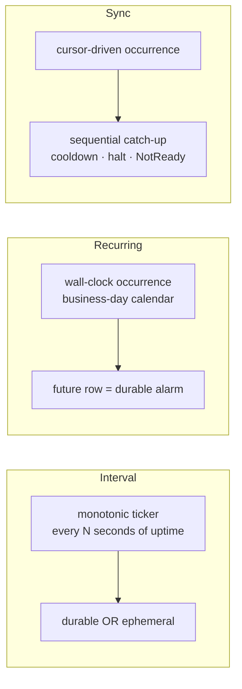
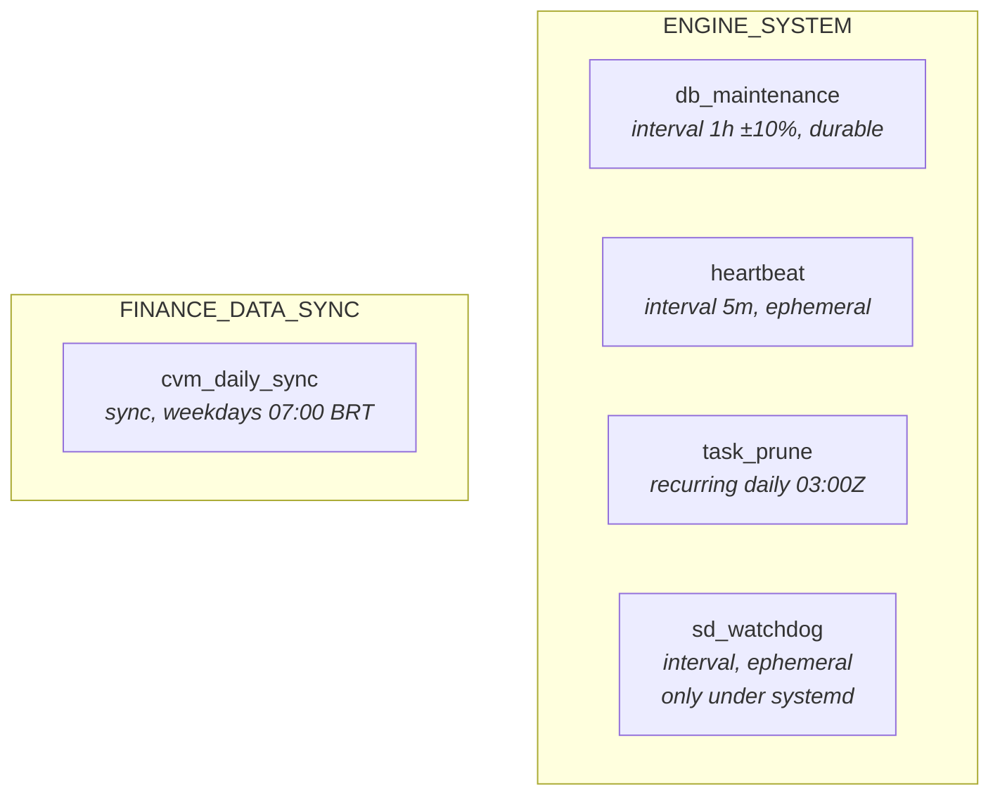

# Overview

Valqeron Engine run recurring background tasks, like database maintenance, liveness pings, operational data pruning,
market-data ingestion jobs, and other.

## What the framework provides

| Concern              | Mechanism                                                     |
|----------------------|---------------------------------------------------------------|
| **Registration**     | One call: `register(TaskSpec, handler)`                       |
| **Scheduling**       | Three *execution planes* — interval, recurring, sync          |
| **Durability**       | Runs are rows in `background_task`; the row *is* the alarm    |
| **Retries**          | Per-run attempt budget with capped exponential backoff        |
| **Crash recovery**   | `RUNNING` rows at boot are requeued or failed                 |
| **Catalog**          | Every registered kind persisted in `task_registration`        |
| **Status**           | Derived on read from catalog ⋈ queue ⋈ cursors — never stored |
| **Operator control** | `paused` flag, honoured within 60s, no restart                |
| **Observability**    | Per-run spans, category-tagged audit events, log policy       |
| **Data sync**        | Cursors, sequential catch-up, cooldowns, halt-on-failure      |

## The three planes at a glance

A task picks exactly one plane. The plane decides *when* the task runs and what its state means; the task itself only
supplies a handler.

|                         | Interval               | Recurring                | Sync                              |
|-------------------------|------------------------|--------------------------|-----------------------------------|
| Clock                   | monotonic (since boot) | wall-clock               | wall-clock                        |
| Survives restart        | no                     | **yes**                  | **yes**                           |
| Catch-up after downtime | none                   | one missed slot          | **every missed period, in order** |
| Persistent progress     | —                      | —                        | `sync_cursor`                     |
| Failure semantics       | retry next tick        | retry next occurrence    | **halt + cooldown**               |
| Typical use             | liveness, housekeeping | daily/weekly maintenance | market-data ingestion             |

## Built-in tasks

Categories (`ENGINE_SYSTEM`, `FINANCE_DATA_SYNC`, `OTHER`) are classification, not behaviour — they drive grouping, log
filtering, and defaults.

## The two guarantees worth internalising

**1. The durable row is the alarm.** For the recurring and sync planes the next occurrence exists as a `PENDING` row
with `scheduled_at` in the future, *before*
that time arrives. Nothing is held in process memory, so a restart, a laptop suspend, or a crash cannot lose a scheduled
run — the row simply becomes past-due and runs at the next boot.

This is not theoretical. A monotonic 24-hour ticker on a user-scoped daemon that restarts at every logout **never
fires**. That was a real bug in
`task_prune`, fixed by moving it to the recurring plane.

**2. Sync progress is a cursor, not a log.** A sync source records how far it has got in `sync_cursor`, independent of
the run history — which
`task_prune` deletes after seven days. Catch-up after a ten-day outage works because the cursor survived, and it
proceeds *one period at a time, in chronological order*, because exactly one row per source is ever in flight.

## Where to go next

- [Architecture](./architecture.md) — the layer boundaries and why they exist
- [Adding a Task](./adding-a-task.md) — the practical walkthrough
- [Scenarios](./scenarios.md) — outage, pause, halt, retire, worked end to end
- [Reference](./reference.md) — constants, env vars, schemas
