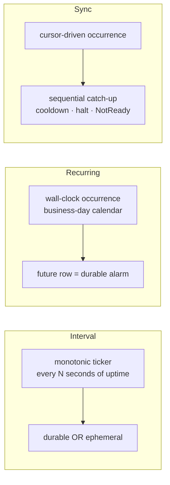
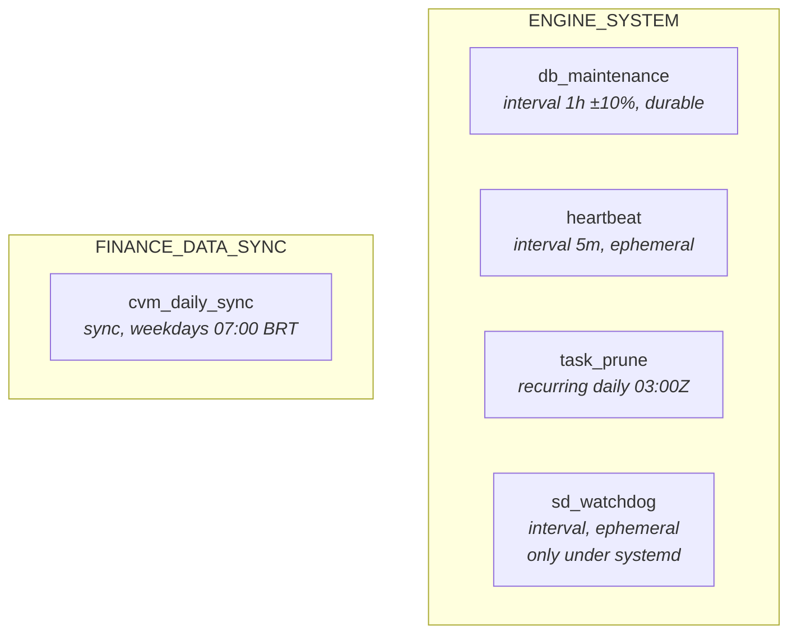

# Overview

The engine runs recurring background work — database maintenance, liveness pings, run-history pruning, market-data
ingestion — through one small framework behind one door: `crate::tasks`. Register a `TaskDefinition` (a typed builder
per *trigger*), hand it a handler, and everything else comes for free.

| Concern              | Mechanism                                                       |
|----------------------|-----------------------------------------------------------------|
| **Registration**     | `BackgroundTasks::builder().task(TaskDefinition::…)`            |
| **Scheduling**       | Three *triggers* — interval, recurring, sync                    |
| **Durability**       | Live work is a row in `task_queue`; the row *is* the alarm      |
| **Retries**          | Per-run attempt budget with capped exponential backoff          |
| **History**          | Terminal runs move to `task_execution` (pruned after 7 days)    |
| **Stats**            | Prune-proof per-kind aggregates in `task_stat` — never deleted  |
| **Crash recovery**   | `RUNNING` rows at boot are requeued or recorded as failed       |
| **Catalog**          | Every registered kind persisted in `task_registry`              |
| **Status**           | Derived on read from catalog ⋈ queue ⋈ stats ⋈ cursors          |
| **Operator control** | `paused` flag (persisted) + per-task worker stop/start (runtime)|
| **Observability**    | Per-run spans, category-tagged audit events, log policy         |
| **Data sync**        | Cursors, sequential catch-up, cooldowns, halt-on-failure        |

## The three triggers at a glance

A task picks exactly one trigger. The trigger decides *when* the task runs and what its state means; the task itself
only supplies a handler.

|                         | Interval               | Recurring                | Sync                              |
|-------------------------|------------------------|--------------------------|-----------------------------------|
| Clock                   | monotonic (since boot) | wall-clock               | wall-clock                        |
| Survives restart        | no                     | **yes**                  | **yes**                           |
| Catch-up after downtime | none                   | one missed slot          | **every missed period, in order** |
| Persistent progress     | —                      | —                        | `sync_cursor`                     |
| Failure semantics       | retry next tick        | retry next occurrence    | **halt + cooldown**               |
| Typical use             | liveness, housekeeping | daily/weekly maintenance | market-data ingestion             |

## Built-in tasks

Categories (`ENGINE_SYSTEM`, `FINANCE_DATA_SYNC`, `OTHER`) are classification, not behaviour — they drive grouping, log
filtering, and defaults.

## The two guarantees worth internalising

**1. The durable row is the alarm.** For the recurring and sync triggers the next occurrence exists as a `PENDING` row
with a future `scheduled_at` *before* that time arrives. Nothing lives in process memory, so a restart, suspend, or
crash cannot lose a scheduled run — the row becomes past-due and runs at the next boot. (A monotonic 24-hour ticker on
a daemon that restarts at every logout **never fires**; that real `task_prune` bug is why the recurring trigger
exists.)

**2. Sync progress is a cursor, not a log.** A sync source records how far it has got in `sync_cursor`, independent of
the run history that `task_prune` deletes after seven days. Catch-up after a ten-day outage works because the cursor
survived — one period at a time, in chronological order, because exactly one row per source is ever in flight. The same
prune-proofness holds for the per-kind aggregates in `task_stat`.

## Where to go next

- [Architecture](./architecture.md) — the façade, the data model, and the life of a run
- [Triggers](./triggers.md) — interval, recurring, and sync in depth
- [Adding a Task](./adding-a-task.md) — the practical walkthrough
- [Operations](./operations.md) — config, status, pause, troubleshooting, scenarios
- [Reference](./reference.md) — constants, schemas, invariants
