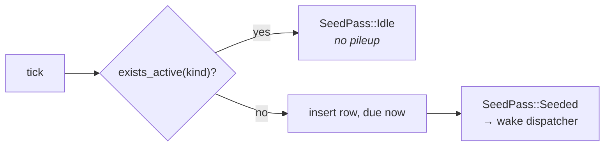

# Interval Plane

Monotonic ticks since boot. `crates/engine/src/tasks/plane/interval.rs`

Use it when the work is about *now* — liveness, housekeeping — and a missed
occurrence costs nothing because the next tick does the same job.

## Configuration

```rust,ignore
PlaneConfig::Interval {
    period: Duration::from_secs(3600),
    jitter: true,                 // ±10%
    tracking: Tracking::Durable,  // or Ephemeral
}
```

## Two tracking modes

```text
DURABLE                                 EPHEMERAL
───────                                 ─────────
tick → gate on exists_active            tick → run handler inline
     → insert row (due now)                  → await completion
     → dispatcher claims, runs                → nothing persisted
     → history + catalog totals

retries, history, status,               no rows, no retries, no stats,
pause honoured                          pause ignored (liveness work)

db_maintenance                          heartbeat, sd_watchdog
```

Ephemeral runs are awaited on the seeder task itself, so two runs of the same
kind can never overlap.

## Timing

```text
boot                                                              
 │                                                                
 ├─ cadence() → first tick at now + period                        
 │                                                                
 ▼                                                                
 ├──── period ────┬──── period ────┬──── period ────┬── …         
 t0              t1               t2               t3             
                 tick             tick             tick           
```

The first tick is **one full period after boot**, not immediately — an engine
restarting frequently never runs interval work at all. That is intentional for
liveness work (a heartbeat right at boot adds nothing) but it is exactly why
`task_prune` was moved off this plane; see
[Recurring § The restart-starvation bug](./plane-recurring.md#the-restart-starvation-bug).

### Jitter

With `jitter: true` the period is scaled into 90–110% once, at spawn, using
sub-second clock noise (no RNG dependency):

```text
period = 3600s  →  jittered ∈ [3240s, 3960s]
```

Applied to both the first tick and the repeating period, this desynchronises
periodic jobs across restarts so several tasks do not pile onto the same
instant.

## Gating

A durable tick inserts nothing while a previous run is still `PENDING` or
`RUNNING`:



A handler that takes longer than its period therefore skips ticks rather than
queueing them.

## Outcome handling

| Outcome | Effect |
|---|---|
| `Done` | Row `SUCCEEDED`; catalog totals bumped (durable only) |
| `NotReady` | Logged at info; treated as success — the next tick is the retry |
| `Failed` | Retry per attempt budget, then terminal `FAILED` + counted |

## Built-in tasks on this plane

| Kind | Period | Jitter | Tracking | Log policy |
|---|---|---|---|---|
| `db_maintenance` | `VALQERON_ENGINE_MAINTENANCE_INTERVAL` (3600s) | ✓ | Durable | `ALL` |
| `heartbeat` | `VALQERON_ENGINE_HEARTBEAT_INTERVAL` (300s) | ✗ | Ephemeral | `FAILURES_ONLY` |
| `sd_watchdog` | half of `WatchdogSec` | ✗ | Ephemeral | `FAILURES_ONLY` |

`sd_watchdog` is registered only when systemd exports a watchdog interval; it is
absent everywhere else.

## When *not* to use it

If you find yourself wanting "every day at 03:00" or "each weekday", you want
[Recurring](./plane-recurring.md). A `Duration::from_secs(86_400)` on this plane
is anchored to process start, drifts with every restart, and never fires on a
machine that restarts more often than the period.
