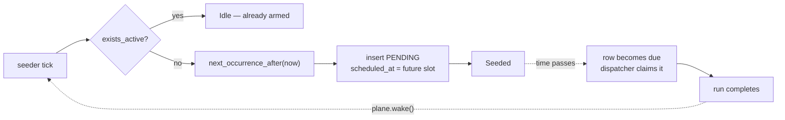

# Recurring Plane

Wall-clock business-day occurrences, always durable.
`crates/engine/src/tasks/plane/recurring.rs`

Use it when the work belongs to a calendar time ("daily at 03:00 UTC") and a
missed occurrence should run once at the next opportunity — but does not need
per-period catch-up.

## Configuration

```rust,ignore
PlaneConfig::Recurring {
    schedule: Schedule::new(MarketCalendar::UTC, time(3, 0), Recurrence::Daily),
    retry: RetryPolicy::none(),
}
```

## The core idea: the row is the alarm

The next occurrence is inserted as a `PENDING` row with `scheduled_at` in the
**future**, long before that time arrives.



Nothing lives in process memory. The schedule is a database row, so a restart,
a suspend, or a crash cannot lose it.

## The restart-starvation bug

This plane exists because of a concrete failure. `task_prune` used to be a
24-hour *interval* task:

```text
INTERVAL (monotonic, anchored to boot)
──────────────────────────────────────
boot ─────────────── 24h ─────────────► would fire here
  │                                        ▲
  └── logout at 8h → restart               │  never reached
        │                                  │
        └── boot ───── 24h ────────────────┘ …restarts again first

Result on a laptop that restarts daily: task_prune NEVER ran.
Terminal task rows accumulated without bound.


RECURRING (wall-clock, row-backed)
──────────────────────────────────
boot ── seeds row @ 03:00Z tomorrow ──────► row persists in SQLite
  │                                              │
  └── logout, restart, suspend, crash            │  unaffected
        │                                        │
        └── boot → row still PENDING ────────────┘
              past due? runs immediately, once.
```

## Catch-up: exactly one slot

There is no cursor, so "how many occurrences did we miss" is not knowable. What
*is* knowable is whether the armed row came due while the engine was down —
and that row runs once at the next boot.

| Engine down | On next boot |
|---|---|
| 02:00 → 04:00 (crossed 03:00) | the armed row is past-due → runs immediately |
| 3 days | the one armed row runs once; the 2 intervening days are not made up |

If every missed period matters, use [Sync](./plane-sync.md).

## Business-day recurrence

`Recurrence::Daily` means *every business day* — weekends (and, once the holiday
table lands, holidays) are skipped:

```text
Fri 03:00Z ── run ──► next occurrence: Mon 03:00Z   (Sat/Sun skipped)
```

`Recurrence::Weekly { on: Weekday }` anchors to one weekday and rolls forward if
that day is not a business day.

For `task_prune` this means a Saturday prune waits until Monday — comfortably
inside the 7-day retention window.

## Timing

`cadence()` returns `(now, RECONCILE_INTERVAL)` — the first pass runs
**immediately at boot**, so re-arming after a restart never waits. Thereafter
the seeder re-evaluates every 60 seconds, and a completed run wakes it directly
so the next occurrence is armed within milliseconds rather than up to a minute.

## Outcome handling

| Outcome | Effect |
|---|---|
| `Done` | Row `SUCCEEDED`; catalog totals bumped |
| `NotReady` | Logged at info; treated as success — the retry is the next occurrence |
| `Failed` | Retry per budget, then terminal `FAILED`; the next occurrence is seeded normally |

With `RetryPolicy::none()` (one attempt) a failure means the next occurrence is
the retry — which for `task_prune` is exactly right.

## Built-in tasks on this plane

| Kind | Schedule | Retry |
|---|---|---|
| `task_prune` | `recurring:daily@03:00+00:00` | none |
