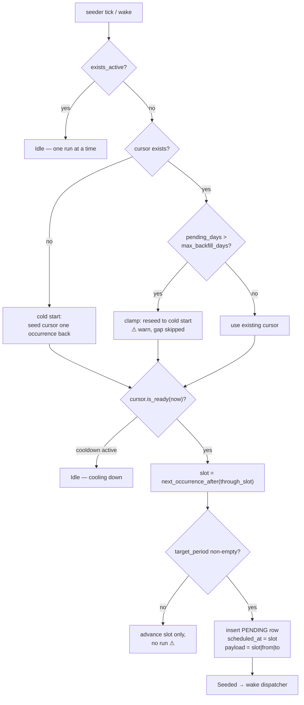
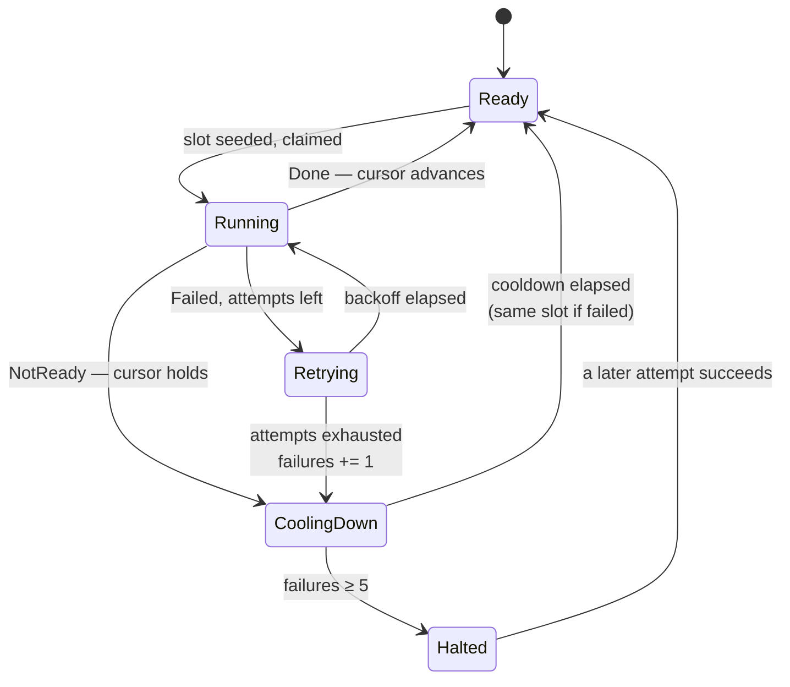

# Sync Plane

Cursor-driven recurrence with sequential catch-up.
`crates/engine/src/tasks/plane/sync.rs`

Use it when each occurrence covers a **distinct period of data** and skipping
one leaves a hole — market-data ingestion, essentially.

## Configuration

```rust,ignore
PlaneConfig::Sync {
    source: SyncSource::new("cvm")?,     // cursor key
    schedule: Schedule::new(MarketCalendar::B3, time(7, 0), Recurrence::Daily),
    retry: RetryPolicy { max_attempts: 3, retry_delay_secs: 300 },
    cooldown: CooldownPolicy::new(300),  // base; doubles, capped at 1h
    max_backfill_days: 90,
}
```

## The cursor

One `sync_cursor` row per source — durable, never pruned, independent of run
history:

```sql
CREATE TABLE sync_cursor (
    source               TEXT NOT NULL PRIMARY KEY,
    through_slot         TEXT NOT NULL,   -- scheduling position
    through_target       TEXT NOT NULL,   -- data coverage position
    cooldown_until       TEXT,            -- NULL = ready now
    consecutive_failures INTEGER NOT NULL DEFAULT 0,
    last_outcome         TEXT,            -- SYNCED|NOT_READY|FAILED
    last_error           TEXT,
    updated_at           TEXT NOT NULL
) STRICT, WITHOUT ROWID;
```

**Why two positions?** `through_slot` answers *"which occurrence did we last
run?"* and drives scheduling. `through_target` answers *"which data dates are
covered?"* and drives period computation. Under `Daily` they advance in
lockstep; under `Weekly` one slot covers five target dates, and conflating them
would create gaps.

## Target periods

A run does not sync "today" — it syncs a period derived from its slot:

```text
to   = previous_business_day(slot_date)
from = next_business_day(cursor.through_target)
```

```text
DAILY (from == to, always exactly one day)
──────────────────────────────────────────
  covered through: Wed
  slot:            Fri 07:00 BRT
  → to   = previous business day of Fri = Thu
  → from = next business day after Wed  = Thu
  → period = [Thu, Thu]        "Friday syncs Thursday"

  Monday's slot → previous business day = Friday
  → period = [Fri, Fri]        "Monday syncs Friday"


WEEKLY on Monday (spans the whole preceding week)
─────────────────────────────────────────────────
  covered through: Fri (week −2)
  slot:            Mon 08:00
  → to   = previous business day of Mon = Fri (week −1)
  → from = next business day after Fri (week −2) = Mon (week −1)
  → period = [Mon, Fri]        the full preceding business week
```

One rule, both recurrences, no gaps by construction. If the period would be
empty (everything already covered), the plane advances `through_slot` without
running and logs it — a recurrence reconfigured mid-life is the only way to get
there.

## The reconcile decision



The whole decision runs inside **one write transaction**, so the gate, the
cursor read, and the insert are atomic.

## Catch-up is the same code path

The elegance: `next_occurrence_after(cursor)` produces a past-due row when the
cursor is stale and a future row when it is current. There is no separate
"backfill mode".

```text
CURSOR CURRENT                          CURSOR STALE (10 days behind)
──────────────                          ─────────────────────────────
next_occurrence_after(cursor)           next_occurrence_after(cursor)
  = tomorrow 07:00                        = 10 days ago 07:00
  → row scheduled in the future           → row already past due
  → dispatcher waits                      → dispatcher claims immediately
                                          → runs, cursor advances
                                          → completion wakes seeder
                                          → next stale slot seeded
                                          → … repeats until caught up
```

### Ten-day outage, step by step

```text
boot ─────────────────────────────────────────────────────────────────►
 │
 │  cursor: through_slot = Aug 3, through_target = Aug 2
 │
 ├─ seed Aug 4 (past due) ─ run ─ covers Aug 3 ─ cursor → Aug 4 ─┐
 │                                                                │ wake
 ├─ seed Aug 5 (past due) ─ run ─ covers Aug 4 ─ cursor → Aug 5 ─┤
 │                                                                │
 ├─ …                                                             │
 │                                                                │
 ├─ seed Aug 14 (past due) ─ run ─ covers Aug 13 ─ cursor → Aug 14┤
 │                                                                │
 └─ seed Aug 17 07:00 (FUTURE) ─── waits ─────────────────────────┘
                                                     caught up
```

Guaranteed **sequential** (one row in flight at a time) and **chronological**
(the cursor only advances on success). Paced by handler completion, not by the
60-second tick, because each completion wakes the seeder.

## Cold start

A source with no cursor seeds it **one occurrence back** from the most recent
one, so the latest period runs immediately and nothing older is attempted:

```text
fresh install, Wednesday 09:00 BRT
  latest occurrence before now = Wed 07:00
  previous occurrence          = Tue 07:00
  → cursor.through_slot   = Tue 07:00
  → cursor.through_target = Mon
  → first run: slot Wed 07:00, period [Tue, Tue]
```

Bulk historical loading is deliberately *not* the daily loop's job.

## The staleness clamp

If the cursor is further behind than `max_backfill_days` (default 90), the plane
refuses an enormous unattended catch-up: it reseeds to cold start, runs only the
most recent period, and warns.

```text
operation="sync_skip" source="cvm" skipped_days=412 max_backfill_days=90
  "sync cursor was too far behind; skipped ahead to the most recent
   occurrence (bulk history needs an explicit backfill)"
```

## Outcomes

| Outcome | Task row | Cursor | Cooldown | Failure count |
|---|---|---|---|---|
| `Done` | `SUCCEEDED` | **advances** past slot + target | cleared | reset to 0 |
| `NotReady` | `SUCCEEDED` | **holds** | `now + retry_after_secs` | **unchanged** |
| `Failed` | retry → `FAILED` | **holds** | on terminal: exponential | **+1** |

### `NotReady` is not an error

The most common non-success for a daily sync is *"the source has not published
yesterday's file yet"*. That must not burn the retry budget, must not log at
error level, and must not count toward halting. It gets its own outcome, its own
cooldown, and an info-level audit line:

```text
operation="sync_not_ready" source="cvm" slot=… retry_after_secs=3600
  "source has not published the target period yet; holding"
```

### Two retry layers, deliberately

```text
LAYER 1 — task attempts (RetryPolicy)      LAYER 2 — cursor cooldown
  3 attempts × 300s, exponential             min(base·2^(n−1), 1h)
  absorbs transient faults inside            absorbs "this period cannot be
  ONE run: a flaky HTTP request              synced yet at all"

  exhausted → terminal FAILED  ────────────► failure counted, cooldown starts,
                                             SAME period retried after it
```

## Halt semantics

On terminal failure the cursor does **not** advance. The same period is retried
after the cooldown, and nothing after it ever runs. No silent gaps in financial
data — a stalled source is loud rather than skipping a day.



At five consecutive terminal failures the log escalates from `warn` to `error`
and the derived status becomes `halted`:

```text
operation="sync_halted" source="cvm" consecutive_failures=5
  cooldown_until=… error="connect timeout"
  "sync source keeps failing terminally; halted on the same period until it succeeds"
```

## At-least-once, and why that is fine

The cursor is owned by the **plane**, not by handlers. `interpret` advances it
after the handler returns `Done`, in a separate transaction from the run's
completion record.

```text
handler succeeds ──► cursor advances ──► completion recorded
                  ▲                   ▲
                  └── crash here?     └── crash here?
                      period re-runs      row recovered → period re-runs,
                      (cursor unchanged)  cursor advance is a no-op
```

Both crash windows re-run a period; neither skips one. **Sync handlers must
therefore be idempotent** — upsert-by-date, not append.

> If exactly-once ever becomes necessary, the handler can take over the cursor
> advance inside the same transaction as its data write. That is possible only
> because engine tables and domain data share one SQLite file; see
> [Catalog § Why one file](./catalog.md#why-one-file).

## Payload format

Compact, dependency-free, parsed only inside this module:

```text
2026-08-12T10:00:00.000Z|2026-08-11|2026-08-11
└──────── slot ────────┘ └─ from ─┘ └── to ──┘
```

`window_for` decodes it into `RunWindow::Period { slot, target }`. Handlers
never see the raw string.

> **The target comes from the payload, never from `Utc::now()`.** A catch-up run
> executing days late must still sync *its own* period. Reading the clock inside
> a handler would make all ten backfill runs sync the same day.

## Built-in tasks on this plane

| Kind | Source | Schedule | Retry | Cooldown | Backfill cap |
|---|---|---|---|---|---|
| `cvm_daily_sync` | `cvm` | `sync:daily@07:00-03:00` | 3 × 300s | 300s base | 90 days |

CVM's handler is currently a placeholder: it logs the period it would ingest and
returns `Done`, which exercises the whole cursor machinery. Real ingestion
changes only `jobs/cvm.rs`.
