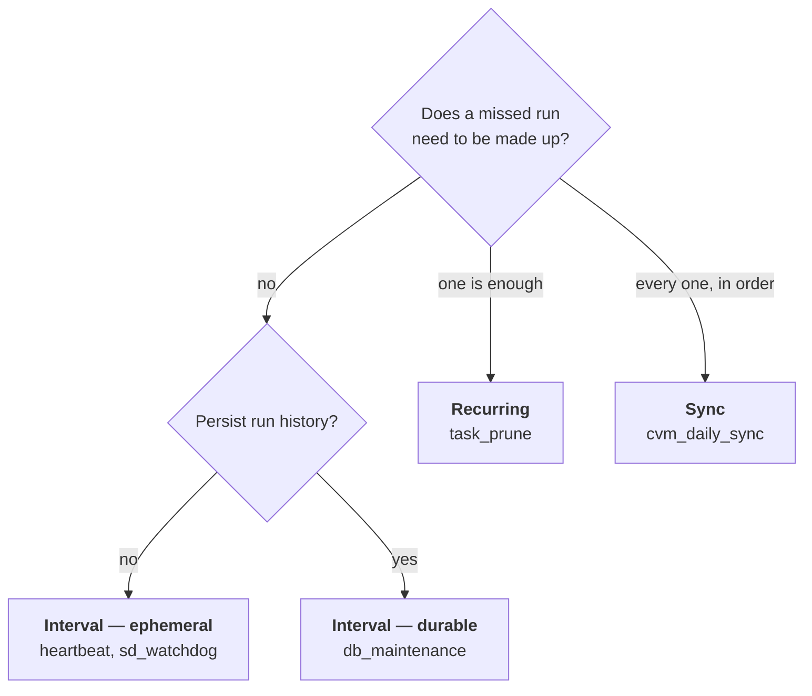
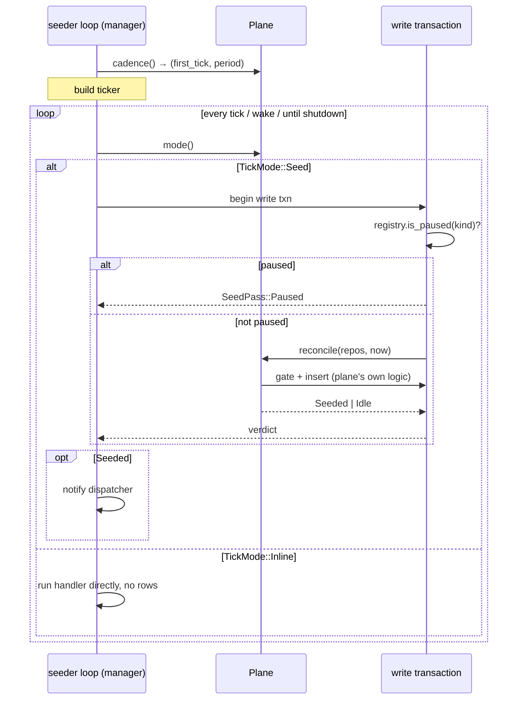

# Execution Planes

A plane defines what a task's *schedule* means and what its state is. Three
exist; each is a superset of the previous in durability guarantees.

## Choosing one



The decisive question is what a missed occurrence costs:

- **Nothing** — the work is about *now* (is the process alive? is the WAL
  checkpointed?). Interval.
- **A delay** — the work is idempotent housekeeping that just needs to happen
  eventually. Recurring.
- **A data gap** — each occurrence covers a distinct period and skipping one
  leaves a hole. Sync.

## Comparison

| | Interval | Recurring | Sync |
|---|---|---|---|
| Clock | monotonic | wall-clock | wall-clock |
| Schedule source | `Duration` | `Schedule` (calendar) | `Schedule` (calendar) |
| Rows | durable or none | always durable | always durable |
| Seeded | when idle, due now | next occurrence, **ahead** | next occurrence after cursor |
| Survives restart | ✗ | ✓ | ✓ |
| Catch-up | none | 1 slot | **unbounded, sequential** |
| Progress state | — | — | `sync_cursor` |
| `paused` honoured | durable only | ✓ | ✓ |
| `NotReady` means | log, next tick | log, next occurrence | **hold cursor + cooldown** |
| Terminal failure | retry next tick | retry next occurrence | **halt + escalating cooldown** |
| `RunWindow` | `None` | `None` | `Period { slot, target }` |

## How the manager drives a plane

The manager runs one seeder per registration and asks the plane four questions.
It never learns the answers' meaning.



The pause gate and the plane's reconcile share **one transaction**, so the gate
cannot race the insert.

## Seeding versus inline

```text
TickMode::Seed                          TickMode::Inline
──────────────                          ────────────────
tick → txn{ gate, reconcile }           tick → run handler inline
     → row inserted                          → nothing persisted
     → dispatcher claims                     → next tick awaits completion
     → handler runs                          
     → completion recorded                Used by: ephemeral interval tasks
     → catalog summary updated            (heartbeat, sd_watchdog)
```

Inline runs deliberately **ignore `paused`**: they are liveness work, and
pausing `sd_watchdog` would let systemd's watchdog kill the engine. They also
record no catalog run stats — `sd_watchdog` at a few seconds' cadence would
generate tens of thousands of pointless UPDATEs per day.

## Serialisation

Every durable plane gates on `exists_active(kind)` — no new row is seeded while
one is `PENDING` or `RUNNING`. Consequences:

- a slow run never piles up behind itself;
- a sync source processes periods strictly one at a time, in order;
- the dispatcher's batch concurrency (`EXECUTION_CONCURRENCY = 2`) parallelises
  *across* kinds, never within one.

## Details per plane

- [Interval](./plane-interval.md)
- [Recurring](./plane-recurring.md)
- [Sync](./plane-sync.md)
