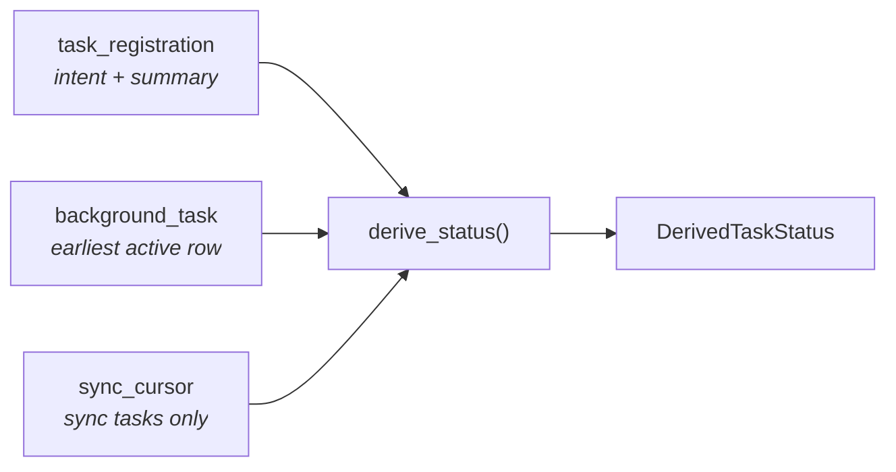

# Status Model

A task's status is **never stored**. It is derived on every read from three
inputs, so it cannot go stale.

## Inputs



`derive_status` is a pure function in `crates/core/src/task_registration.rs` —
no clock, no I/O, exhaustively unit-tested.

```rust,ignore
derive_status(
    registration: &TaskRegistration,
    active:       Option<&BackgroundTask>,   // earliest PENDING/RUNNING row
    cursor:       Option<&SyncCursor>,
    halted_after: u32,                       // 5
    now:          DateTime<Utc>,
) -> DerivedTaskStatus
```

## The truth table

First match wins — the order encodes precedence.

| # | Status | Condition |
|---|---|---|
| 1 | `retired` | `registered = 0` |
| 2 | `disabled` | `config_enabled = 0` |
| 3 | `paused` | `paused = 1` |
| 4 | `running` | an active row is `RUNNING` |
| 5 | `halted` | sync: `consecutive_failures ≥ halted_after` |
| 6 | `cooling_down` | sync: `cooldown_until > now` |
| 7 | `catching_up` | sync: active row is past due |
| 8 | `waiting` | active row `scheduled_at > now` |
| 9 | `due` | active row past due (non-sync) |
| 10 | `idle` | nothing queued |

Why this order:

- **1–3 before everything** — an operator or config decision explains the task's
  state better than whatever the queue happens to hold. A paused task with a
  leftover row is *paused*, not *waiting*.
- **4 before sync states** — if it is executing right now, that is the most
  useful fact, even for a source that is also behind.
- **5 before 6** — `halted` is the escalated form of `cooling_down`; a source at
  five failures should not read as merely "cooling down".
- **7 before 8** — a sync source with a past-due row is working through history,
  which is materially different from waiting for a future slot.
- **9 vs 7** — the same row shape means `catching_up` for a sync task and `due`
  for a task without a cursor.

`idle` is normal for ephemeral tasks (they never queue rows) and transient for
durable ones (the instant between a completion and the next seed).

## The read model

```rust,ignore
list_task_statuses(registry, tasks, cursors, halted_after, now)
    -> Vec<TaskStatusEntry>

struct TaskStatusEntry {
    registration: TaskRegistration,
    status:       DerivedTaskStatus,
    next_run_at:  Option<DateTime<Utc>>,   // from the pending row
    cursor:       Option<SyncCursor>,      // sync detail
}
```

It runs on the read lane and joins per kind. Today its consumers are tests; the
`ListTasks` RPC and `vq engine tasks` are a planned follow-up.

## Example output

A healthy engine mid-morning on a Wednesday:

| kind | status | next run | last run | outcome | runs/fails |
|---|---|---|---|---|---|
| `db_maintenance` | `waiting` | 12:38Z | 11:41Z | SUCCEEDED | 162/0 |
| `heartbeat` | `idle` | — | — | — | 0/0 |
| `sd_watchdog` | `idle` | — | — | — | 0/0 |
| `task_prune` | `waiting` | Thu 03:00Z | Wed 03:00Z | SUCCEEDED | 7/0 |
| `cvm_daily_sync` | `waiting` | Thu 07:00 BRT | Wed 07:00 BRT | SUCCEEDED | 31/0 |

The same engine after CVM has been failing:

| kind | status | detail |
|---|---|---|
| `cvm_daily_sync` | **`halted`** | `consecutive_failures=5`, `cooldown_until=12:44Z`, `through_target=Fri 21`, `last_error="connect timeout"` |
| `old_cleanup` | `retired` | last run Aug 12, 41 runs / 2 failures — preserved after removal from code |

Before the catalog existed, both of those facts lived only in a JSON log file.

## Querying it directly

Until the RPC lands, the raw joins are straightforward:

```sql
-- catalog + next run
SELECT r.kind, r.category, r.schedule,
       r.registered, r.config_enabled, r.paused,
       r.last_outcome, r.total_runs, r.total_failures,
       (SELECT MIN(scheduled_at) FROM background_task b
         WHERE b.kind = r.kind AND b.status = 'PENDING') AS next_run_at
FROM task_registration r
ORDER BY r.category, r.kind;

-- sync detail
SELECT source, through_slot, through_target,
       consecutive_failures, cooldown_until, last_outcome, last_error
FROM sync_cursor;
```
