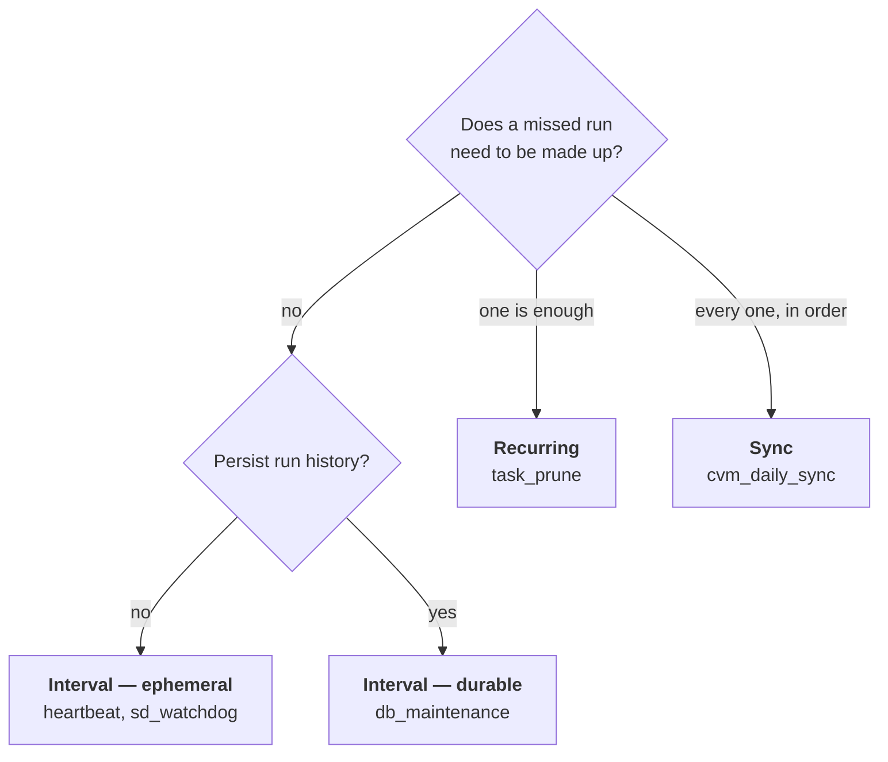
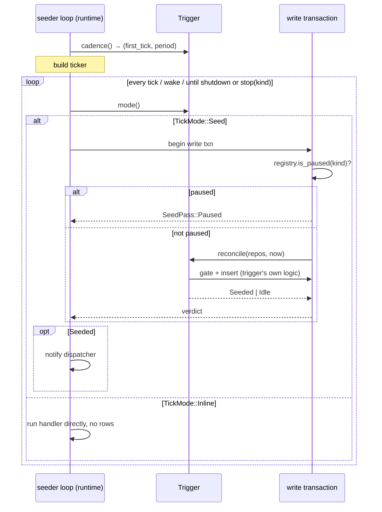
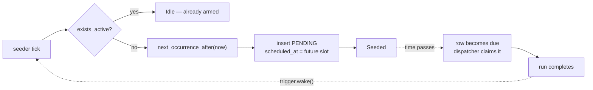
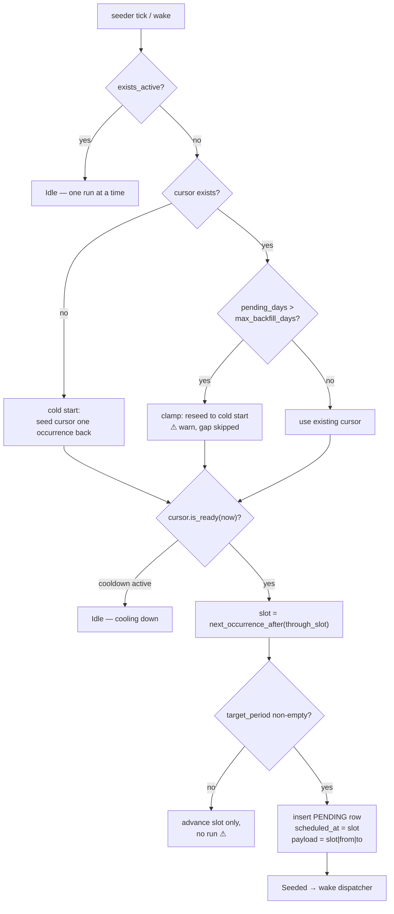
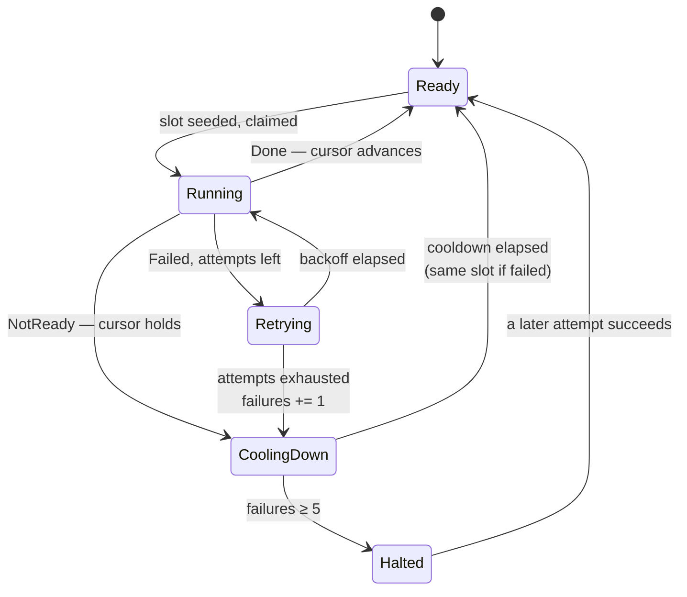

# Triggers

A trigger defines what a task's *schedule* means and what its state is — the same seam Quartz calls a trigger and
Airflow calls a timetable. Three exist; each is a superset of the previous in durability guarantees. A task picks one
through its `TaskDefinition` builder and never sees the machinery.

## Choosing one



The decisive question is what a missed occurrence costs: **nothing** (the work is about *now*) → interval; **a delay**
(idempotent housekeeping that needs to happen eventually) → recurring; **a data gap** (each occurrence covers a
distinct period) → sync.

| | Interval | Recurring | Sync |
|---|---|---|---|
| Builder | `TaskDefinition::interval(kind, period)` | `::recurring(kind, schedule)` | `::sync(kind, source, schedule)` |
| Clock | monotonic | wall-clock | wall-clock |
| Rows | durable or none | always durable | always durable |
| Seeded | when idle, due now | next occurrence, **ahead** | next occurrence after cursor |
| Survives restart | ✗ | ✓ | ✓ |
| Catch-up | none | 1 slot | **unbounded, sequential** |
| Progress state | — | — | `sync_cursor` |
| `paused` honoured | durable only | ✓ | ✓ |
| `RunWindow` | `None` | `None` | `Period { slot, target }` |

One outcome vocabulary; each trigger interprets it, and the interpretation is what the execution history records
(`SUCCEEDED`, `NOT_READY`, `FAILED` — "waited" is not "worked", and neither is a failure):

| Outcome | Interval | Recurring | Sync |
|---|---|---|---|
| `Done` | history `SUCCEEDED`, stats folded | same | same **+ cursor advances** |
| `NotReady` | history `NOT_READY`; the retry is the next tick | same; the retry is the next occurrence | same **+ cursor holds, cooldown set, no failure counted** |
| `Failed` | retry per budget → terminal `FAILED` | same | same **+ terminal holds cursor, counts failure, starts escalating cooldown** |

## How the runtime drives a trigger

One seeder loop per registration; the runtime asks the trigger four questions and never learns the answers' meaning.



```text
TickMode::Seed                          TickMode::Inline
──────────────                          ────────────────
tick → txn{ gate, reconcile }           tick → run handler inline
     → row inserted                          → nothing persisted
     → dispatcher claims                     → next tick awaits completion
     → handler runs                          
     → terminal move recorded             Used by: ephemeral interval tasks
       (history + stats)                  (heartbeat, sd_watchdog)
```

Inline runs deliberately **ignore `paused`** — they are liveness work, and pausing `sd_watchdog` would let systemd's
watchdog kill the engine. They record no history and no stats (a few-second cadence would mean tens of thousands of
pointless rows per day).

**Serialisation.** Every durable trigger gates on `exists_active(kind)` — no new row while one is queued (every
`task_queue` row is live by construction). A slow run never piles up behind itself; a sync source processes periods
strictly one at a time; the dispatcher's `EXECUTION_CONCURRENCY = 2` parallelises *across* kinds, never within one.

## Interval

Monotonic ticks since boot (`trigger/interval.rs`). For work that is about *now* — liveness, housekeeping — where a
missed occurrence costs nothing because the next tick does the same job.

```rust,ignore
TaskDefinition::interval(DB_MAINTENANCE_TASK, config.maintenance_interval())
    .category(TaskCategory::EngineSystem)
    .run(handler)                    // defaults: durable, ±10% jitter, log ALL

TaskDefinition::interval(HEARTBEAT_TASK, config.heartbeat_interval())
    .category(TaskCategory::EngineSystem)
    .ephemeral()                     // inline, no jitter, log FAILURES_ONLY
    .run(handler)
```

```text
DURABLE                                 EPHEMERAL
───────                                 ─────────
tick → gate on exists_active            tick → run handler inline
     → insert row (due now)                  → await completion
     → dispatcher claims, runs                → nothing persisted
     → history + stats

retries, history, status,               no rows, no retries, no stats,
pause honoured                          pause ignored (liveness work)

db_maintenance                          heartbeat, sd_watchdog
```

Ephemeral runs are awaited on the seeder loop itself, so two runs of the same kind can never overlap.

The first tick is **one full period after boot**, not immediately — a heartbeat right at boot adds nothing. With the
default jitter the period is scaled into 90–110% once, at spawn (sub-second clock noise, no RNG dependency), applied to
both the first tick and the repeating period, so periodic jobs desynchronise across restarts. `.ephemeral()` turns
jitter off (liveness wants precise cadence); `.no_jitter()` does the same for durable work.

| Kind | Period | Jitter | Tracking | Log policy |
|---|---|---|---|---|
| `db_maintenance` | `VALQERON_ENGINE_MAINTENANCE_INTERVAL` (3600s) | ✓ | Durable | `ALL` |
| `heartbeat` | `VALQERON_ENGINE_HEARTBEAT_INTERVAL` (300s) | ✗ | Ephemeral | `FAILURES_ONLY` |
| `sd_watchdog` | half of `WatchdogSec`; only under systemd | ✗ | Ephemeral | `FAILURES_ONLY` |

> **When not to use it:** if you want "every day at 03:00" or "each weekday", you want [Recurring](#recurring). A
> 24-hour interval is anchored to process start, drifts with every restart, and never fires on a machine that restarts
> more often than the period.

## Recurring

Wall-clock business-day occurrences, always durable (`trigger/recurring.rs`). For work that belongs to a calendar time
and where a missed occurrence should run once at the next opportunity — without per-period catch-up.

```rust,ignore
TaskDefinition::recurring(
    TASK_PRUNE_TASK,
    Schedule::new(MarketCalendar::UTC, time(3, 0), Recurrence::Daily),
)
.category(TaskCategory::EngineSystem)
.run(handler)                        // defaults: no retries, log ALL
```

The core idea — **the row is the alarm**. The next occurrence is inserted as a `PENDING` row with a *future*
`scheduled_at`, long before that time arrives:



This trigger exists because of a concrete failure — `task_prune` used to be a 24-hour *interval* task:

```text
INTERVAL (monotonic, anchored to boot)      RECURRING (wall-clock, row-backed)
──────────────────────────────────────      ──────────────────────────────────
boot ────────── 24h ──────► would fire      boot ── seeds row @ 03:00Z tomorrow
  │                            ▲              │        (persists in SQLite)
  └── logout at 8h → restart   │ never        └── logout, restart, suspend …
        │                      │ reached            │
        └── boot ── 24h ───────┘                    └── boot → row still PENDING
                                                          past due? runs now, once.
Result on a laptop restarting daily:
task_prune NEVER ran; terminal rows
accumulated without bound.
```

There is no cursor, so "how many occurrences were missed" is unknowable — only whether the armed row came due while the
engine was down. Catch-up is therefore **exactly one slot**:

| Engine down | On next boot |
|---|---|
| 02:00 → 04:00 (crossed 03:00) | the armed row is past-due → runs immediately |
| 3 days | the one armed row runs once; the 2 intervening days are not made up |

If every missed period matters, use [Sync](#sync).

`Recurrence::Daily` means *every business day* — a Friday 03:00Z run is followed by Monday 03:00Z.
`Recurrence::Weekly { on }` anchors to one weekday and rolls forward if it is not a business day. For `task_prune` a
Saturday prune waits until Monday — comfortably inside the 7-day retention window.

`cadence()` returns `(now, RECONCILE_INTERVAL)`: the first pass runs **immediately at boot** (re-arming never waits),
then every 60 seconds, and a completed run wakes the seeder directly so the next occurrence is armed within
milliseconds.

| Kind | Schedule | Retry |
|---|---|---|
| `task_prune` | `recurring:daily@03:00+00:00` | none — the next occurrence *is* the retry |

## Sync

Cursor-driven recurrence with sequential catch-up (`trigger/sync.rs`). For work where each occurrence covers a
**distinct period of data** and skipping one leaves a hole — market-data ingestion, essentially.

```rust,ignore
TaskDefinition::sync(
    CVM_DAILY_SYNC_TASK,
    source,                                 // SyncSource: the cursor key
    Schedule::new(MarketCalendar::B3, settings.at, settings.recurrence),
)
// defaults: retry 3×300s, cooldown base 300s, backfill cap 90 days
.cooldown_secs(settings.cooldown_secs)
.max_backfill_days(settings.max_backfill_days)
.run(handler)
```

One `sync_cursor` row per source — durable, never pruned, independent of run history:

```sql
CREATE TABLE sync_cursor (
    source               TEXT NOT NULL PRIMARY KEY,
    through_slot         TEXT NOT NULL,   -- scheduling position
    through_target       TEXT NOT NULL,   -- data coverage position
    cooldown_until       TEXT,            -- NULL = ready now
    consecutive_failures INTEGER NOT NULL DEFAULT 0,
    last_outcome         TEXT,            -- SYNCED|NOT_READY|FAILED
    last_error           TEXT,
    updated_at           TEXT NOT NULL
) STRICT, WITHOUT ROWID;
```

**Why two positions?** `through_slot` answers *"which occurrence did we last run?"* (drives scheduling);
`through_target` answers *"which data dates are covered?"* (drives period computation). Under `Daily` they advance in
lockstep; under `Weekly` one slot covers five target dates, and conflating them would create gaps.

### Target periods

A run does not sync "today" — it syncs a period derived from its slot:
`to = previous_business_day(slot_date)`, `from = next_business_day(cursor.through_target)`.

```text
DAILY (from == to, always exactly one day)       WEEKLY on Monday (whole preceding week)
──────────────────────────────────────────       ───────────────────────────────────────
covered through: Wed                             covered through: Fri (week −2)
slot:            Fri 07:00 BRT                   slot:            Mon 08:00
→ to   = prev business day of Fri = Thu          → to   = prev business day of Mon = Fri (wk −1)
→ from = next business day after Wed = Thu       → from = next after Fri (wk −2)   = Mon (wk −1)
→ period = [Thu, Thu]  "Friday syncs Thursday"   → period = [Mon, Fri]  the full week
```

One rule, both recurrences, no gaps by construction. An empty period (everything already covered) advances
`through_slot` without running — only reachable by reconfiguring the recurrence mid-life.

### The reconcile decision



The whole decision runs inside **one write transaction** — gate, cursor read, and insert are atomic.

- **Cold start** seeds the cursor one occurrence back, so the latest period runs immediately and nothing older is
  attempted. Bulk historical loading is deliberately not the daily loop's job.
- **The staleness clamp**: beyond `max_backfill_days` (default 90) the trigger refuses an enormous unattended catch-up —
  it reseeds to cold start, runs only the most recent period, and warns (`operation="sync_skip" skipped_days=…`).

### Catch-up is the same code path

`next_occurrence_after(cursor)` produces a past-due row when the cursor is stale and a future row when it is current.
There is no separate "backfill mode":

```text
CURSOR CURRENT                          CURSOR STALE (10 days behind)
──────────────                          ─────────────────────────────
next_occurrence_after(cursor)           next_occurrence_after(cursor)
  = tomorrow 07:00                        = 10 days ago 07:00
  → row scheduled in the future           → row already past due
  → dispatcher waits                      → dispatcher claims immediately
                                          → runs, cursor advances
                                          → completion wakes seeder
                                          → next stale slot seeded
                                          → … repeats until caught up
```

Guaranteed **sequential** (one row in flight) and **chronological** (the cursor only advances on success), paced by
handler completion rather than the 60-second tick.

### Failure semantics

| Outcome | History records | Cursor | Cooldown | Failure count |
|---|---|---|---|---|
| `Done` | `SUCCEEDED` | **advances** past slot + target | cleared | reset to 0 |
| `NotReady` | `NOT_READY` | **holds** | `now + retry_after_secs` | **unchanged** |
| `Failed` | retry stays queued → terminal `FAILED` | **holds** | on terminal: exponential | **+1** |

`NotReady` is not an error: *"the source has not published yesterday's file yet"* must not burn the retry budget, log
at error level, or count toward halting. It gets its own outcome — in the handler vocabulary, on the cursor, **and** in
the execution history — plus an info-level `operation="sync_not_ready"` line.

Two retry layers, deliberately:

```text
LAYER 1 — task attempts (RetryPolicy)      LAYER 2 — cursor cooldown
  3 attempts × 300s, exponential             min(base·2^(n−1), 1h)
  absorbs transient faults inside            absorbs "this period cannot be
  ONE run: a flaky HTTP request              synced yet at all"

  exhausted → terminal FAILED  ────────────► failure counted, cooldown starts,
                                             SAME period retried after it
```

On terminal failure the cursor does **not** advance: the same period is retried after the cooldown and nothing after it
ever runs. No silent gaps in financial data — a stalled source is loud rather than skipping a day.



At five consecutive terminal failures the log escalates from `warn` to `error` (`operation="sync_halted"`) and the
derived status becomes `halted`. Recovery is automatic — the first success clears the counter and catch-up resumes.

### At-least-once

The cursor is owned by the **trigger**, not by handlers: `interpret` advances it after `Done`, in a separate
transaction from the run's terminal move.

```text
handler succeeds ──► cursor advances ──► terminal move recorded
                  ▲                   ▲
                  └── crash here?     └── crash here?
                      period re-runs      row recovered → period re-runs,
                      (cursor unchanged)  cursor advance is a no-op
```

Both crash windows re-run a period; neither skips one. **Sync handlers must therefore be idempotent** — upsert-by-date,
not append. (If exactly-once ever becomes necessary, a handler can take over the cursor advance inside the same
transaction as its data write — possible only because engine tables and domain data share one SQLite file; see
[Architecture § Why one file](./architecture.md#why-one-file).)

The row payload is compact and parsed only inside this module; `window_for` decodes it into
`RunWindow::Period { slot, target }` and handlers never see the raw string:

```text
2026-08-12T10:00:00.000Z|2026-08-11|2026-08-11
└──────── slot ────────┘ └─ from ─┘ └── to ──┘
```

> **The target comes from the payload, never from `Utc::now()`.** A catch-up run executing days late must still sync
> *its own* period.

| Kind | Source | Schedule | Retry | Cooldown | Backfill cap |
|---|---|---|---|---|---|
| `cvm_daily_sync` | `cvm` | `sync:daily@07:00-03:00` | 3 × 300s | 300s base | 90 days |

CVM's handler is currently a placeholder: it logs the period it would ingest and returns `Done`, which exercises the
whole cursor machinery. Real ingestion changes only `jobs/cvm.rs`.
